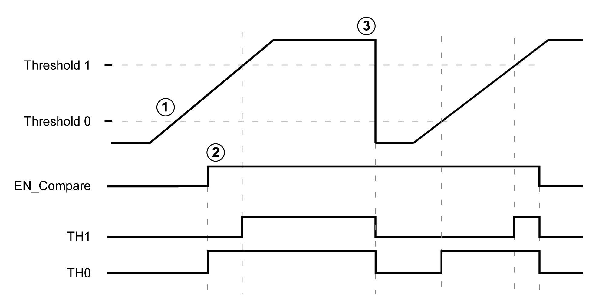
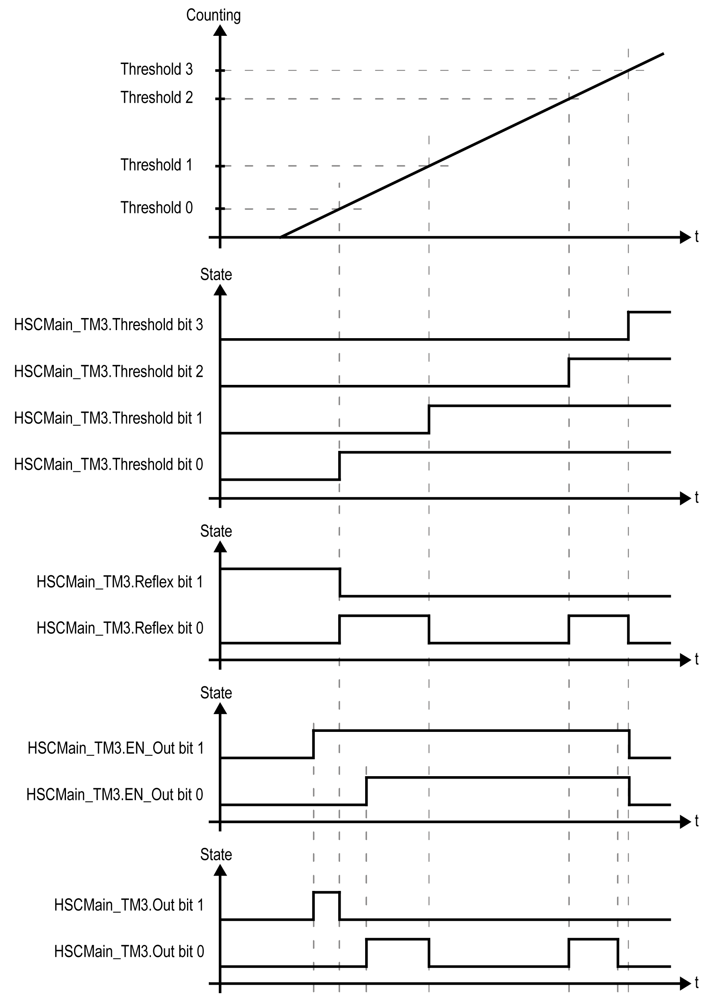

# Comparison Principle with a Main type

## Overview

The compare block with the Main type manages thresholds, reflex outputs and events in the following modes:

* [One-shot](D-SE-0006660.html#D-SE-0006660)
* [Modulo-loop](D-SE-0006663.html#D-SE-0006663)
* [Free-Large](D-SE-0006668.html#D-SE-0006668)
* [Period Meter](D-SE-0006680.html#D-SE-0006680)

Comparison is configured in the Configuration screen by activating at least one threshold.

Comparison can be used to trigger:

* [a programming action on thresholds](#D-SE-0006712__D-SE-0006712.6)
* [an event on a threshold associated with an external task](#D-SE-0006712__D-SE-0006712.7)

  NOTE: This option is only available for TM3XF• expansion modules, which support external events.
* [reflex outputs](#D-SE-0006712__D-SE-0006712.8).

## Principle of a Comparison

The Main type can manage up to four thresholds.

A threshold is a configured value that is compared to the counting value. Thresholds are used to define up to five zones or to react to a value crossing the threshold value.

Threshold values are defined in the configuration window and can also be adjusted in the application program by using the `HSCSetParam_TM3` function block.

If Thresholdx (x= 0, 1, 2, 3) is configured and comparison is enabled (`EN_Compare` = 1), output pin THx of the `HSCMain_TM3` function block is:

* set when counter value >= Thresholdx
* reset when counter value < Thresholdx

NOTE: When `EN_Compare` is set to 0 on `HSCMain_TM3` function block, comparison functions are disabled, including external tasks triggered by a threshold event and Reflex outputs.

The following example for Modulo loop with two thresholds shows comparison in the `HSCMain_TM3` function block:

| Stage | Action |
| --- | --- |
| 1 | When `EN_Compare = 0`, the function is not operational. |
| 2 | When `EN_Compare = 1` as the counter value is already over `Threshold 0`, `TH0` is set to 1. |
| 3 | The counter is reset, due to a synchronization condition for example. |

## Configuring Event Triggering in HSC Main Single or Dual Phase

Configuring an event on threshold crossing allows to trigger an external task. You can choose to trigger an event when a configured threshold is crossed as follows:

* Upward Cross. The event is triggered when the measured value goes above the threshold value.
* Downward Cross. The event is triggered when the measured value goes below the threshold value.
* Both Cross. The event is triggered when the measured value goes above the threshold value and when the measured value goes below the threshold value.

## Configuring Event Triggering in Period Meter Mode

Configuring an event allows to trigger an external task. You can choose to trigger an event as follows:

* Below threshold value. The event is triggered when the measured value is lower than the threshold value.
* Above threshold value. The event is triggered when the measured value is higher than the threshold value.
* Between threshold values. The event is triggered when the measured value is between two threshold values.

## Threshold Behavior

Using thresholds comparison status available in the task context (`TH0` to `TH3` output pins of the function block) is suitable for an application tolerant of the inherent lag of cycle times and asynchronism of communications, especially when using the modules over a field bus in distributed architectures.

## Configuring Reflex Output

Follow this procedure to configure reflex outputs:

| Step | Action |
| --- | --- |
| 1 | In Compare > Thresholds > Number of thresholds select a number of thresholds.  **Result:** Threshold values and Reflex Outputs are displayed. |
| 2 | Enter the value in the value field of each threshold value.  NOTE: EcoStruxure Machine Expert follow this rule to configure the threshold values and adapt them if necessary: TH0 < TH1 < TH2 < TH3 < TH4.  NOTE: For HSC Main functions, you can set a higher value for thresholds than defined in Preset field. |
| 3 | Configure the Reflex Outputs. |

## Reflex Output Behavior

Configuring reflex outputs allows to trigger physical reflex outputs.

These outputs are not controlled in the task context, reducing the reaction time to a minimum. This is convenient for operations that need fast execution.

Outputs used by the High Speed Counter can only be accessed through the function block. They cannot be read or written directly within the application.

Example of the reflex outputs triggered by threshold:

NOTE: The state of the reflex outputs depends on the configuration.

## Changing the Threshold Values

Care must be exercised when threshold compares are active to avoid unintended or unexpected results from the outputs or from sudden Event task execution. If the compare function is disabled, threshold values can be modified freely. However, if the compare function is enabled, suspend at least the threshold compare function while modifying the threshold values.

| WARNING | |
| --- | --- |
|  | UNINTENDED EQUIPMENT OPERATION  * Do not change the Threshold values without using the `SuspendCompare` input if `EN_Compare` is equal to 1. * Verify that `TH0` is less than `TH1`, that `TH1` is less than `TH2`, and that `TH2` is less than `TH3` before reactivating the threshold compare function.  Failure to follow these instructions can result in death, serious injury, or equipment damage. |

While `EN_Compare` = 1, the comparison is active, and it is necessary to follow this procedure to apply changes to threshold values:

| Step | Action |
| --- | --- |
| 1 | Set `SuspendCompare` to 1.  The comparison is frozen at the counter value:   * The `Thresholds`, `Reflex`, and `Out` output bits of the function block maintain their last value. * Physical outputs 0, 1 maintain their last value * Events are masked   NOTE: `EN_Compare`, `EN_Out`, and `F_Out` remain operational while `SuspendCompare` is set. |
| 2 | Modify the threshold values as needed using the `HSCSetParam_TM3` function block. |
| 3 | Set `SuspendCompare` to 0.  The new threshold values are applied and the comparison is resumed. |

EIO0000003683.02

© 2022

Schneider Electric.

All rights reserved.