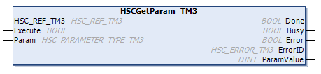

# HSCGetParam\_TM3: Returns Parameters of HSC

## Function Block Description

This administrative function block returns a parameter value of an HSC.

## Graphical Representation

## IL and ST Representation

To see the general representation in IL or ST language, refer to [*Function and Function Block Representation*](D-SE-0002384.html#D-SE-0002384).

## I/O Variables Description

This table describes the input variables:

| Inputs | Type | Comment |
| --- | --- | --- |
| `HSC_REF_TM3` | `HSC_REF_TM3` | Reference of the HSC instance.  Must not be changed during function block execution. |
| `Execute` | `BOOL` | On rising edge, starts the function block execution.  On falling edge, resets the outputs of the function block when its execution terminates. |
| `Param` | `HSC_PARAMETER_TYPE_TM3` | Parameter to read. |

This table describes the output variables:

| Outputs | Type | Comment |
| --- | --- | --- |
| `Done` | `BOOL` | `TRUE` = indicates that `ParamValue` is valid.  Function block execution is finished. |
| `Busy` | `BOOL` | `TRUE` = indicates that the function block execution is in progress. |
| `Error` | `BOOL` | `TRUE` = indicates that an error was detected.  Function block execution is finished. |
| `ErrorID` | `HSC_ERROR_TM3` | Indicates the value of the error detected. |
| `ParamValue` | `DINT` | Value of the parameter that has been read. |

NOTE: For more information about the `Execute`, `Done`, and `Busy` pins, refer to [General Information on Administrative Function Block Management](D-SE-0094625.html#D-SE-0094625).

## Adding the HSCGetParam\_TM3 Function Block

| Step | Description |
| --- | --- |
| 1 | Select the Libraries tab in the Software Catalog and click Libraries.  Select Intern > IODrivers > TM3 HSC > Administrative > HSCGetParam\_TM3 in the list, drag-and-drop the item onto the POU window. |
| 2 | Set the value of the HSC\_REF\_TM3 input to the instance name of the HSC. |

EIO0000003683.02

© 2022

Schneider Electric.

All rights reserved.