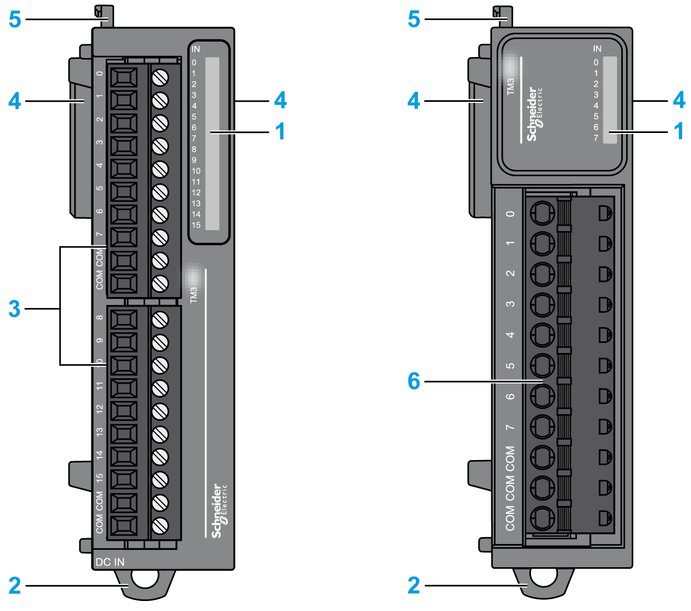
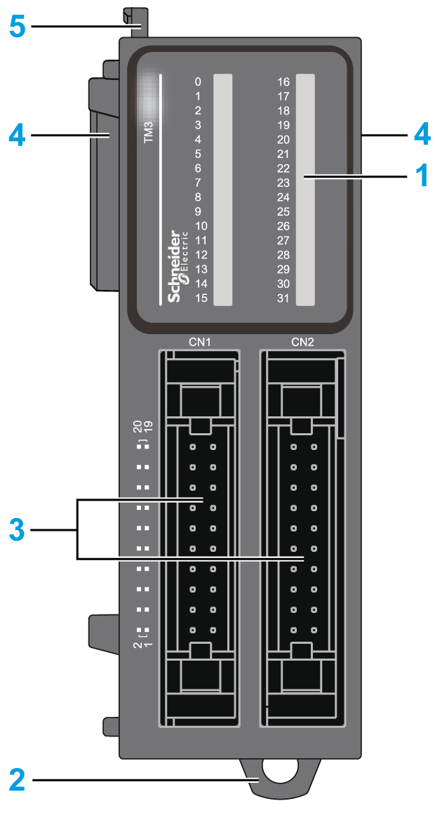

# Physical Description

## Introduction

This section describes the physical characteristics of the TM3 digital expansion modules. The modules, depending on the reference, support one of two different types of connectors:

* Removable screw or spring terminal block
* HE10 (MIL 20) connector

## TM3 Digital I/O Modules with Removable Screw or Spring Terminal Block

The following figure shows the main elements of TM3 digital expansion modules with removable screw or spring terminal block:

This table describes the main elements of the TM3 digital expansion modules shown above:

| N° | Description | Refer to |
| --- | --- | --- |
| 1 | LEDs for displaying the state of the I/O channels | – |
| 2 | Clip-on lock for 35 mm (1.38 in.) top hat section rail (DIN rail) | [Top Hat Section Rail (DIN rail)](TopHatSectionRailDINRail-8CC2B316.html) |
| 3 | Removable terminal block (screw) | [Rules for Removable Screw Terminal Block](D-SE-0026685.html#D-SE-0026685__D-SE-0026685.10) |
| 4 | Expansion connector for TM3 I/O bus (one on each side) | – |
| 5 | Locking device for attachment to the previous module | – |
| 6 | Removable terminal block (spring) | [Rules for Removable Spring Terminal Block](D-SE-0026685.html#D-SE-0026685__D-SE-0026685.11) |

## TM3 Digital I/O Modules with HE10 (MIL 20) Connector

The following figure shows the main elements of a TM3 digital expansion module with HE10 (MIL 20) connector:

This table describes the main elements of the TM3 digital expansion module shown above:

| N° | Description | Refer to |
| --- | --- | --- |
| 1 | LEDs for displaying the state of the I/O channels | – |
| 2 | Clip-on lock for 35 mm (1.38 in.) top hat section rail (DIN-rail) | [Top Hat Section Rail (DIN rail)](TopHatSectionRailDINRail-8CC2B316.html) |
| 3 | HE10 (MIL 20) connector socket | [Cables](D-SE-0025669.html#D-SE-0025669__D-SE-0025669.17) |
| 4 | Expansion connector for TM3 I/O bus (one on each side) | – |
| 5 | Locking device for attachment to the previous module | – |

EIO0000003125.05