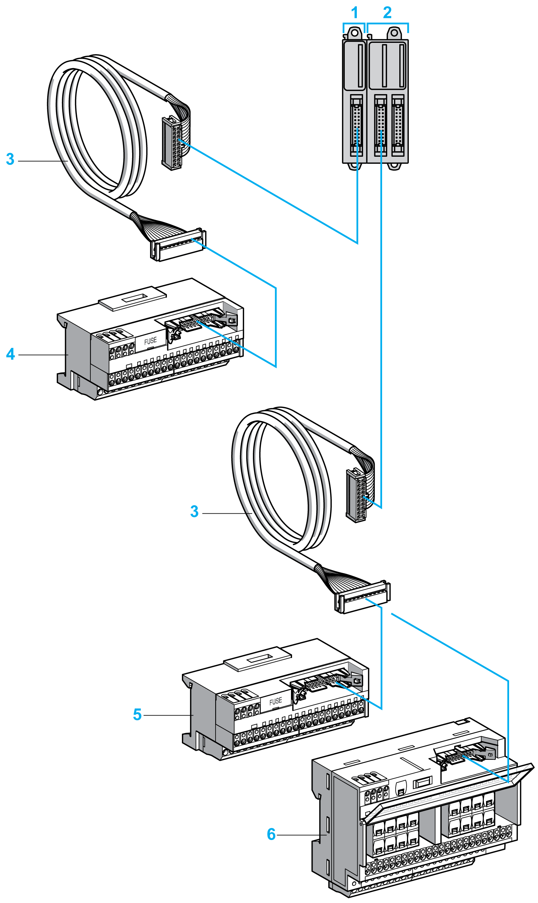

# Accessories

## Overview

This section describes the accessories, cables, and Telefast.

## Accessories

| Reference | Description | Use | | Quantity |
| --- | --- | --- | --- | --- |
| TMAT2MSET | Set of 8 removable screw terminal blocks:   * 4 x Removable screw terminal blocks (pitch 3.81 mm) with 11 terminals for inputs/outputs * 4 x Removable screw terminal blocks (pitch 3.81 mm) with 10 terminals for inputs/outputs | Connects the module I/Os. | | 1 |
| TMAT2MSETG | Set of 8 removable spring terminal blocks:   * 4 x Removable spring terminal blocks (pitch 3.81 mm) with 11 terminals for inputs/outputs * 4 x Removable spring terminal blocks (pitch 3.81 mm) with 10 terminals for inputs/outputs |
| NSYTRAAB35 | End brackets | Helps secure the controller or receiver module and their expansion modules on a top hat section rail (DIN rail). | |
| TMAM2 | Mounting kit | Mounts the controller and I/O modules directly to a flat, vertical panel. | |
| TM200RSRCEMC | Shielding take-up clip | Mounts and connects the ground to the cable shielding. | | 25-pack |

For top hat section rails (DIN rails), refer to [Top Hat Section Rail (DIN rail)](TopHatSectionRailDINRail-8CC2B316.html).

## Cables

| Reference | Description | Details | Length |
| --- | --- | --- | --- |
| TWDFCW••K | Digital I/O cables with free wires for 20-pin connectors | Cable equipped at one end with an HE10/MIL20 connector (AWG 22 / 0.34 mm2). | 3 or 5 m  (9.84 or 16.4 ft) |

## TWDFCW••K Cable Description

The following table provides specifications for the TWDFCW••K cable with free wires for 20-pin connectors (HE10/MIL20):

| Cable illustration | Pin Connector | Wire Color |
| --- | --- | --- |
|  | 1 | White |
| 2 | Brown |
| 3 | Green |
| 4 | Yellow |
| 5 | Grey |
| 6 | Pink |
| 7 | Blue |
| 8 | Red |
| 9 | Black |
| 10 | Violet |
| 11 | Grey and pink |
| 12 | Red and blue |
| 13 | White and green |
| 14 | Brown and green |
| 15 | White and yellow |
| 16 | Yellow and brown |
| 17 | White and grey |
| 18 | Grey and brown |
| 19 | White and pink |
| 20 | Pink and brown |

## Telefast Pre-Wiring Sub-Bases

The following illustration shows the Telefast system:

**1** TM3DI16K / TM3DI32K

**2** TM3DQ16TK / TM3DQ32TK

**3** Cable equipped with a 20-way HE10/MIL20 connector at each end.

**4** 16 channel sub-base for input extension modules.

**5–6** 16 channel sub-base for output extension modules.

Refer to [TM3 Digital I/O Modules Instruction Sheet](http://download.schneider-electric.com/files?p_Doc_Ref=HRB59605).

EIO0000003125.05