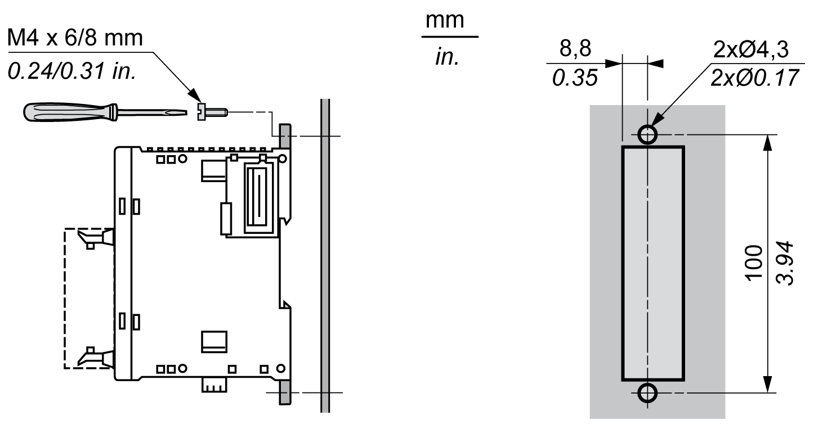
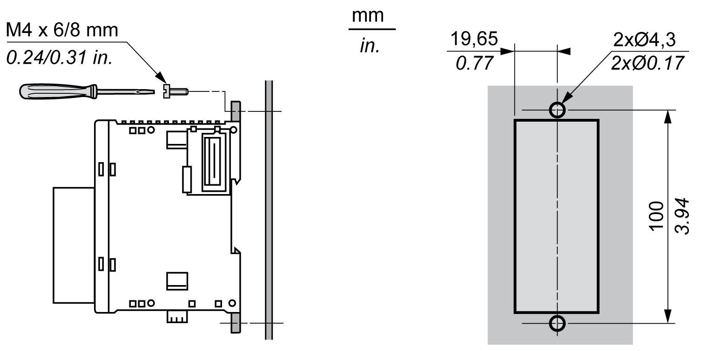
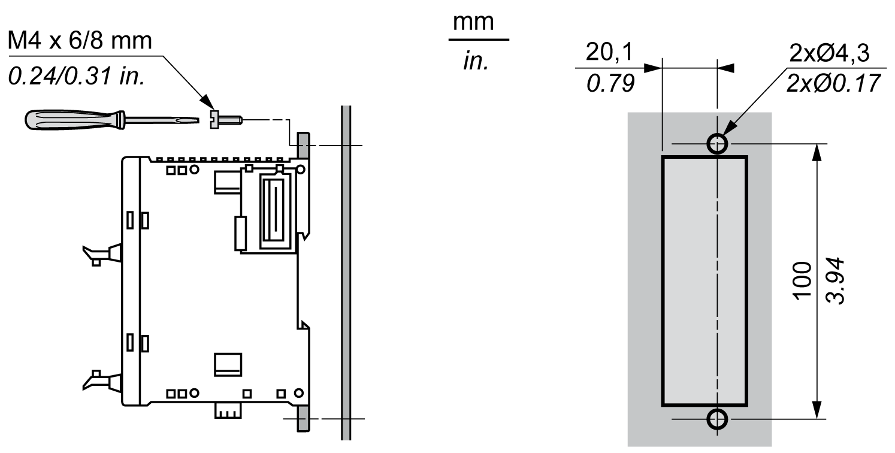
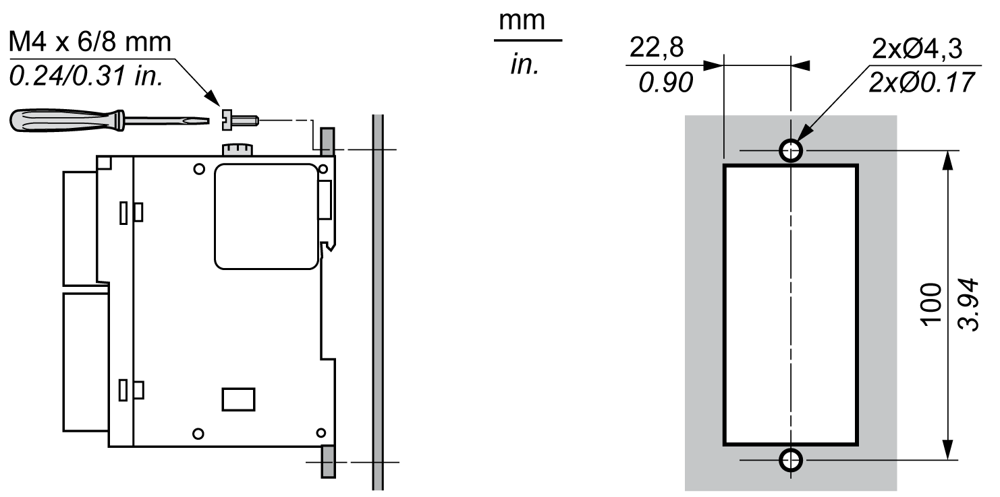

# Direct Mounting on a Panel Surface

## Overview

This section shows how to install TM3 expansion module using the Panel Mounting Kit. This section also provides mounting hole layout for all modules.

## Installing the Panel Mounting Kit

The following procedure shows how to install a mounting strip:

| Step | Action |
| --- | --- |
| 1 | Insert the mounting strip TMAM2 into the slot at the top of the module. |

## Mounting Hole Layout

The following diagram shows the mounting hole layout for TM3 with 8 and 16 screw or spring I/O channels:

The following diagram shows the mounting hole layout for TM3 with 24 screw or spring I/O channels:

The following diagram shows the mounting hole layout for TM3 with 32 HE10 (MIL 20) I/O channels:

The following diagram shows the mounting hole layout for the TM3DM32R expansion module:

EIO0000003125.05