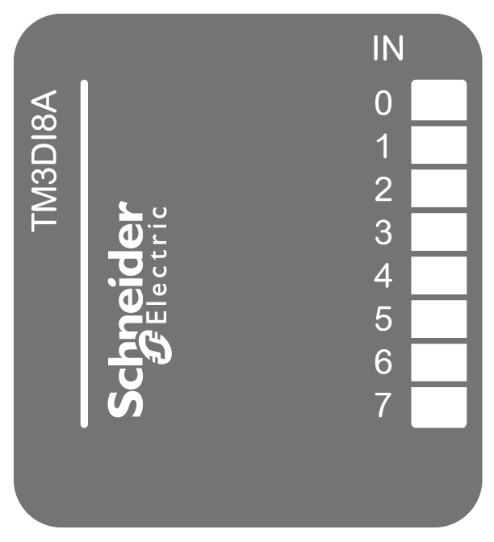

# TM3DI8A Presentation

## Overview

TM3DI8A (screw) digital expansion module:

* 8 channels
* 120 Vac digital input
* 2 common lines
* Removable screw terminal block

## Main Characteristics

| Characteristic | | Value | |
| --- | --- | --- | --- |
| Number of input channels | | 8 | |
| Input type | | Type 1 (IEC/EN 61131-2) | |
| Logic type | | N/A | |
| Rated input voltage | | 120 Vac | |
| Connection type | | Removable screw terminal block | |
| Cable type and length | Type | Stranded wire 2,5 mm² | |
| Length | - | |

## Status LEDs

The following figure shows the status LEDs:

This table describes the status LEDs:

| LED | Color | Status | Description |
| --- | --- | --- | --- |
| 0...7 | Green | On | The input channel is activated. |
| Off | The input channel is deactivated. |

EIO0000003125.05