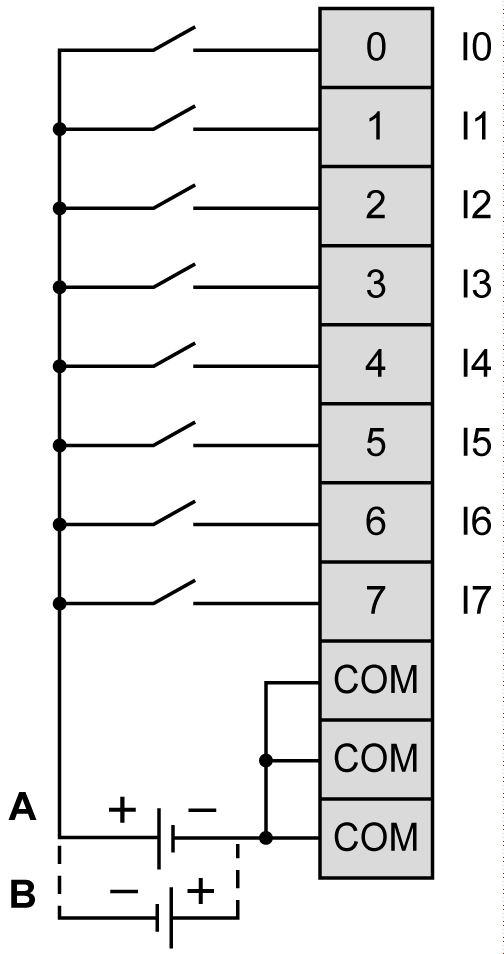

# TM3DI8 / TM3DI8G Wiring Diagram

## Introduction

These expansion modules have a built-in removable screw or spring terminal block for the connection of inputs and power supply.

## Wiring Rules

See [Wiring Best Practices](D-SE-0026685.html#D-SE-0026685).

## Wiring Diagram

The following figure illustrates the connection between the inputs, the sensors, and their commons:

The 3 COM terminals are connected internally.

**A** Sink wiring (positive logic)

**B** Source wiring (negative logic)

For information about 24 Vdc power supply, refer to [DC Power Supply Characteristics](D-SE-0037101.html#D-SE-0037101).

EIO0000003125.05