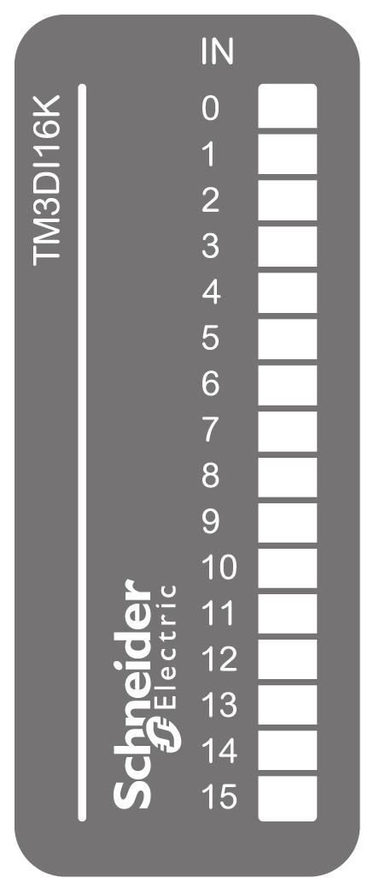

# TM3DI16K Presentation

## Overview

TM3DI16K (HE10) digital expansion module:

* 16 channels
* 24 Vdc digital input
* 1 common line
* Sink/source
* HE10 (MIL 20) connector

## Main Characteristics

| Characteristic | | Value | |
| --- | --- | --- | --- |
| Number of input channels | | 16 | |
| Input type | | Type 1 (IEC/EN 61131-2) | |
| Logic type | | Sink/Source | |
| Rated input voltage | | 24 Vdc | |
| Connection type | | HE10 (MIL 20) connector | |
| Cable type and length | Type | Unshielded | |
| Length | Maximum 30 m (98 ft) | |
| Weight | | 65 g (2.30 oz) | |

## Status LEDs

The following figure show the status LEDs:

This table describes the status LEDs:

| LED | Color | Status | Description |
| --- | --- | --- | --- |
| 0...15 | Green | On | The input channel is activated |
| Off | The input channel is deactivated |

EIO0000003125.05