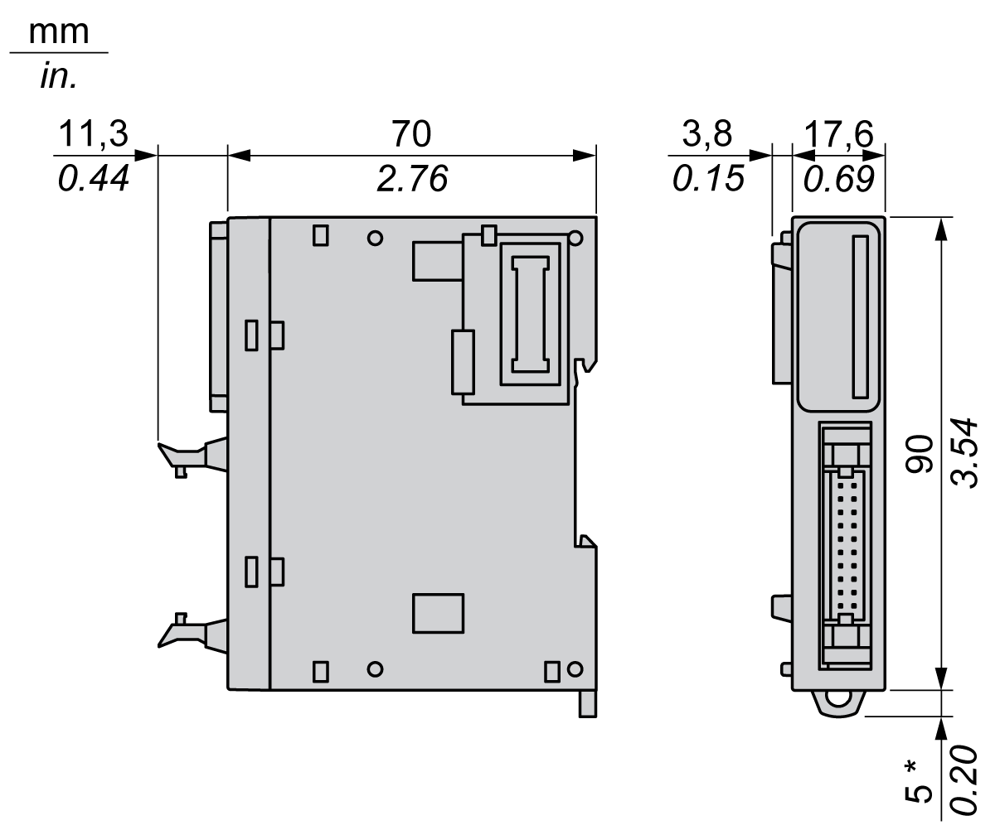
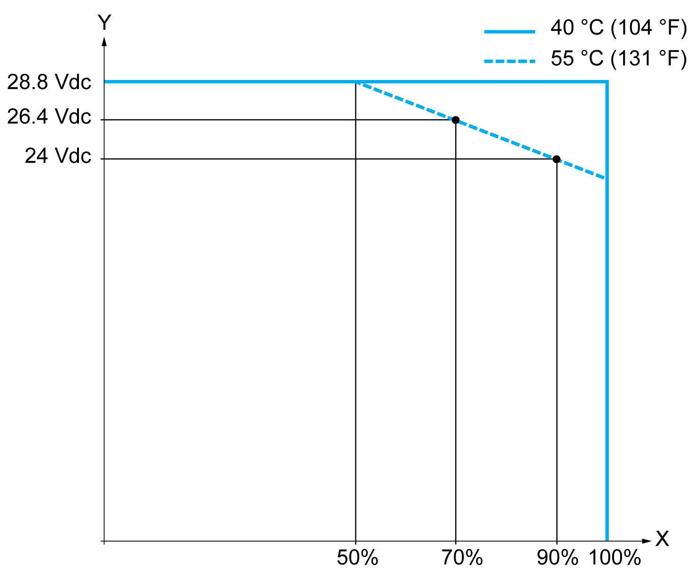

# TM3DI16K Characteristics

## Introduction

This section provides a description of the input characteristics of TM3DI16K expansion module.

See also [Environmental Characteristics](D-SE-0025238.html#D-SE-0025238).

| WARNING | |
| --- | --- |
|  | UNINTENDED EQUIPMENT OPERATION  Do not exceed any of the rated values specified in the environmental and electrical characteristics tables.  Failure to follow these instructions can result in death, serious injury, or equipment damage. |

## Dimensions

The following diagrams show the external dimensions for the TM3DI16K expansion module:

**\*** 8.5 mm (0.33 in.) when the clamp is pulled out.

## Input Characteristics

The table below describes the inputs characteristics of the TM3DI16K:

| Characteristic | | Value | |
| --- | --- | --- | --- |
| Number of input channels | | 16 inputs | |
| Number of channels groups | | 1 common line on 2 pins for 16 channels | |
| Input type | | Type 1 (IEC/EN 61131-2) | |
| Logic type | | Sink/Source | |
| Rated input voltage | | 24 Vdc | |
| Input voltage range | | 19.2...28.8 Vdc | |
| Rated input current | | 5 mA | |
| Input impedance | | 4.4 kΩ | |
| Input limit values | Voltage at state 1 | > 15 Vdc (15...28.8 Vdc) | |
| Voltage at state 0 | < 5 Vdc (0...5 Vdc) | |
| Current at state 1 | > 2.5 mA | |
| Current at state 0 | < 1.0 mA | |
| Turn on time | | SV(1) < 2.0: 4 ms  SV(1) ≥ 2.0: 100 µs(2) | |
| Turn off time | |
| Isolation | Between input and internal logic | 500 Vac | |
| Between input groups | N/A | |
| Connection type | | HE10 (MIL 20) connector | |
| Connector insertion/removal durability | | Over 100 times | |
| Current draw on 5 Vdc internal bus | | 34 mA (all inputs on)  5 mA (all inputs off) | |
| Current draw on 24 Vdc internal bus | | 0 mA (all inputs on) | |
| 0 mA (all inputs off) | |
| **(1)** SV refers to the version and is printed on the product label.  **(2)** The range depends on the configured filter value. If you use EcoStruxure Machine Expert - Basic, refer to the Modicon TM3 (EcoStruxure Machine Expert - Basic) Expansion Modules Configuration - Programming Guide. If you use EcoStruxure Machine Expert, refer to the Modicon TM3 Expansion Modules - Programming Guide. | | | |

## I/O Re-rating

When using TM3DI16K:

**X** Input simultaneous ON ratio

**Y** Input voltage

EIO0000003125.05