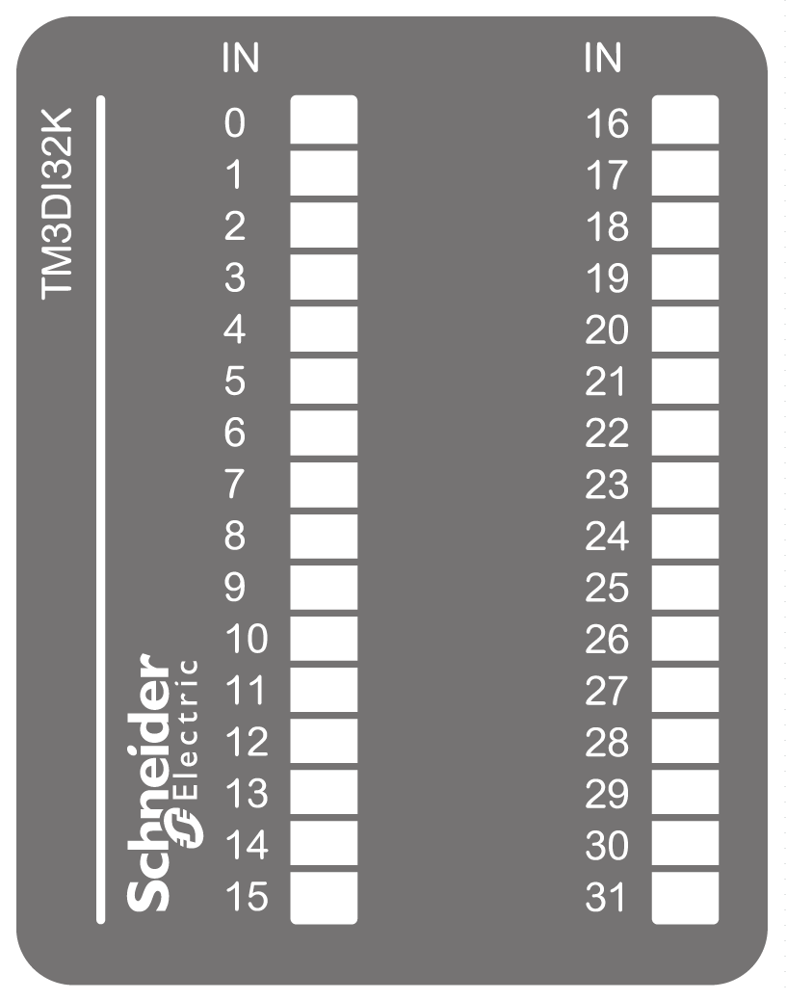

# TM3DI32K Presentation

## Overview

TM3DI32K (HE10) digital expansion module:

* 32 channels
* 24 Vdc digital input
* 2 common lines
* Sink/source
* HE10 (MIL 20) connector

## Main Characteristics

| Characteristic | | Value |
| --- | --- | --- |
| Number of input channels | | 32 |
| Input type | | Type 1 (IEC/EN 61131-2) |
| Logic type | | Sink/Source |
| Rated input voltage | | 24 Vdc |
| Connection type | | HE10 (MIL 20) connectors |
| Cable type and length | Type | Unshielded |
| Length | Maximum 30 m (98 ft) |
| Weight | | 100 g (3.52 oz) |

## Status LEDs

The following figure shows the status LEDs:

This table describes the status LEDs:

| LED | Color | Status | Description |
| --- | --- | --- | --- |
| 0...31 | Green | On | The input channel is activated |
| Off | The input channel is deactivated |

EIO0000003125.05