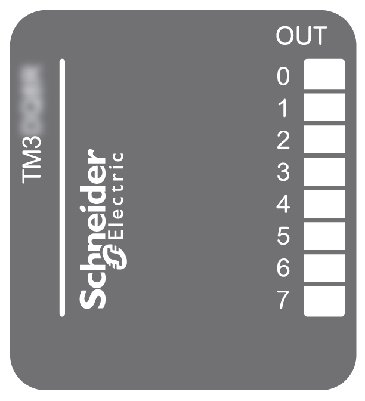

# TM3DQ8R / TM3DQ8RG Presentation

## Overview

TM3DQ8R (screw) and TM3DQ8RG (spring) digital expansion module:

* 8 channels
* 2 A relay outputs
* 1 common line
* Removable screw or spring terminal block

## Main Characteristics

| Characteristic | | Value | |
| --- | --- | --- | --- |
| Number of output channels | | 8 outputs | |
| Contact type | | NO (Normally Open) | |
| Output type | | Relay | |
| Rated output voltage | | 24 Vdc / 240 Vac | |
| Rated output current | | 2 A | |
| Connection type | TM3DQ8R | Removable screw terminal block | |
| TM3DQ8RG | Removable spring terminal block | |
| Cable type and length | Type | Unshielded | |
| Length | Maximum 30 m (98 ft) | |
| Weight | | 110 g (3.90 oz) | |

## Status LEDs

The following figure shows the status LEDs:

This table describes the status LEDs:

| LED | Color | Status | Description |
| --- | --- | --- | --- |
| 0...7 | Green | On | The output channel is activated. |
| Off | The output channel is deactivated. |

EIO0000003125.05