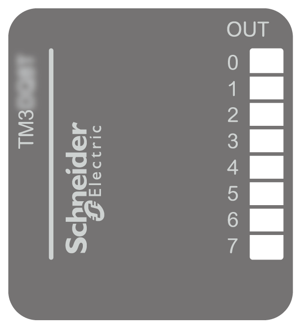

# TM3DQ8T / TM3DQ8TG Presentation

## Overview

TM3DQ8T (screw) and TM3DQ8TG (spring) digital expansion module:

* 8 channels
* 0.5 A source outputs
* 1 common line
* Removable screw or spring terminal block

## Main Characteristics

| Characteristic | | Value | |
| --- | --- | --- | --- |
| Number of output channels | | 8 | |
| Logic type | | Source | |
| Rated output voltage | | 24 Vdc | |
| Rated output current | | 0.5 A | |
| Connection type | TM3DQ8T | Removable screw terminal block | |
| TM3DQ8TG | Removable spring terminal block | |
| Cable type and length | Type | Unshielded | |
| Length | Maximum 30 m (98 ft) | |
| Weight | | 76 g (2.7 oz) | |

## Status LEDs

The following figure shows the status LEDs:

This table describes the status LEDs:

| LED | Color | Status | Description |
| --- | --- | --- | --- |
| 0...7 | Green | On | The output channel is activated |
| Off | The output channel is deactivated |

EIO0000003125.05