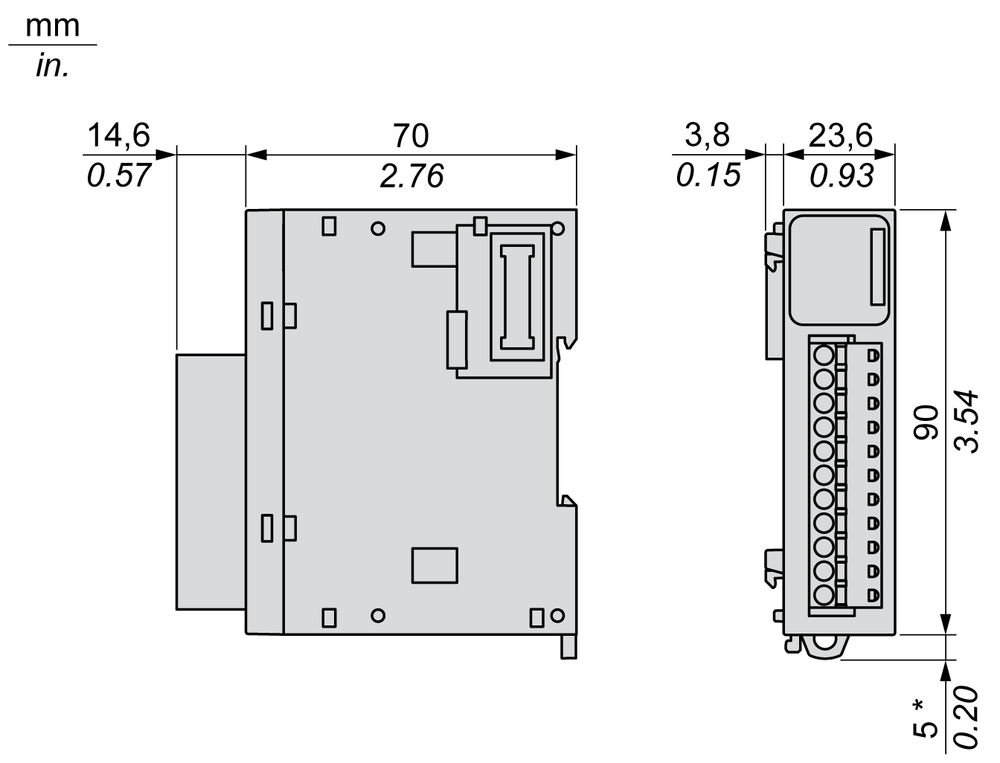

# TM3DQ8T / TM3DQ8TG Characteristics

## Introduction

This section provides a description of the output characteristics of the TM3DQ8T / TM3DQ8TG expansion modules.

See also [Environmental Characteristics](D-SE-0025238.html#D-SE-0025238).

| WARNING | |
| --- | --- |
|  | UNINTENDED EQUIPMENT OPERATION  Do not exceed any of the rated values specified in the environmental and electrical characteristics tables.  Failure to follow these instructions can result in death, serious injury, or equipment damage. |

## Dimensions

The following diagrams show the external dimensions for the TM3DQ8T / TM3DQ8TG expansion modules:

**\*** 8.5 mm (0.33 in.) when the clamp is pulled out.

## Output Characteristics

The table below describes the outputs characteristics of the TM3DQ8T / TM3DQ8TG:

| Characteristic | | Value |
| --- | --- | --- |
| Number of output channels | | 8 |
| Number of channel groups | | 1 common line for 8 channels |
| Output type | | Transistor |
| Logic type | | Source |
| Rated output voltage | | 24 Vdc |
| Output voltage range | | 19.2...28.8 Vdc |
| Rated output current | | 0.5 A maximum per channel |
| Total output current per group | | 4 A |
| Voltage drop | | 0.4 Vdc maximum |
| Leakage current when switched off | | 0.1 mA maximum |
| Maximum power of filament lamp | | 12 W |
| Inductive load | | L/R = 10 ms |
| De-rating | - 10...55 °C (14...131 °F) | No de-rating |
| Turn on time | | 450 µs |
| Turn off time | | 450 µs |
| Protection against short circuit | | Yes |
| Short circuit output peak current | | 1 A typically |
| Automatic rearming after short circuit or overload | | Yes, time depending on the expansion module temperature |
| Protection against reverse polarity | | Yes |
| Clamping voltage | | Typically 50 Vdc |
| Switching frequency | Under resistive load | 100 Hz maximum |
| Isolation | Between output and internal logic | 500 Vac |
| Between channel group | N/A |
| Connection type | TM3DQ8T | Removable screw terminal block |
| TM3DQ8TG | Removable spring terminal block |
| Connector insertion/removal durability | | Over 100 times |
| Current draw on 5 Vdc internal bus | | 17 mA (all outputs on)  5 mA (all outputs off) |
| Current draw on 24 Vdc internal bus | | 8 mA (all outputs on)  0 mA (all outputs off) |
| NOTE: Refer to [Protecting Outputs from Inductive Load Damage](D-SE-0026685.html#D-SE-0026685__D-SE-0026685.6) for additional information concerning output protection. | | |

EIO0000003125.05