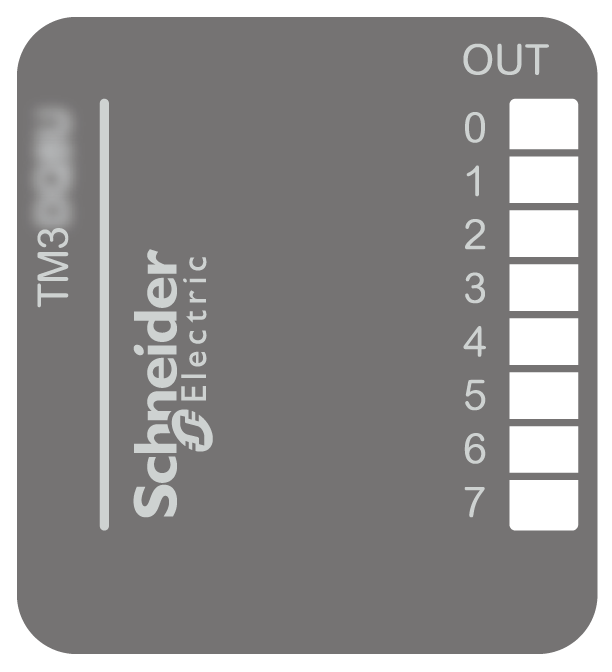

# TM3DQ8U / TM3DQ8UG Presentation

## Overview

TM3DQ8U (screw) and TM3DQ8UG (spring) digital expansion module:

* 8-channels
* 0.5 A sink outputs
* 1 common line
* Removable screw or spring terminal block

## Main Characteristics

| Characteristic | | Value |
| --- | --- | --- |
| Number of output channels | | 8 |
| Logic type | | Sink |
| Rated output voltage | | 24 Vdc |
| Rated output current | | 0.5 A |
| Connection type | TM3DQ8U | Removable screw terminal block |
| TM3DQ8UG | Removable spring terminal block |
| Cable type and length | Type | Unshielded |
| Length | Maximum 30 m (98 ft) |
| Weight | | 76 g (2.7 oz) |

## Status LEDs

The following figure shows the status LEDs:

This table describes the status LEDs:

| LED | Color | Status | Description |
| --- | --- | --- | --- |
| 0...7 | Green | On | The output channel is activated. |
| Off | The output channel is deactivated. |

EIO0000003125.05