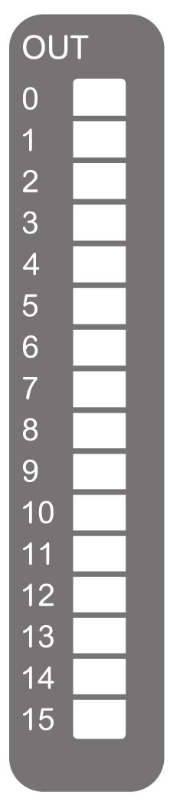

# TM3DQ16R / TM3DQ16RG Presentation

## Overview

TM3DQ16R (screw) and TM3DQ16RG (spring) digital expansion module:

* 16 channels
* 2 A relay outputs
* 2 common lines
* Removable screw or spring terminal blocks

## Main Characteristics

| Characteristic | | Value |
| --- | --- | --- |
| Number of output channels | | 16 outputs |
| Contact type | | NO (Normally Open) |
| Output type | | Relay |
| Rated output voltage | | 24 Vdc, 240 Vac |
| Rated output current | | 2 A |
| Connection type | TM3DQ16R | Removable screw terminal blocks |
| TM3DQ16RG | Removable spring terminal blocks |
| Cable type and length | Type | Unshielded |
| Length | Maximum 30 m (98 ft) |
| Weight | | 145 g (5.11 oz) |

## Status LEDs

The following figure shows the status LEDs:

This table describes the status LEDs:

| LED | Color | Status | Description |
| --- | --- | --- | --- |
| 0...15 | Green | On | The output channel is activated |
| Off | The output channel is deactivated |

EIO0000003125.05