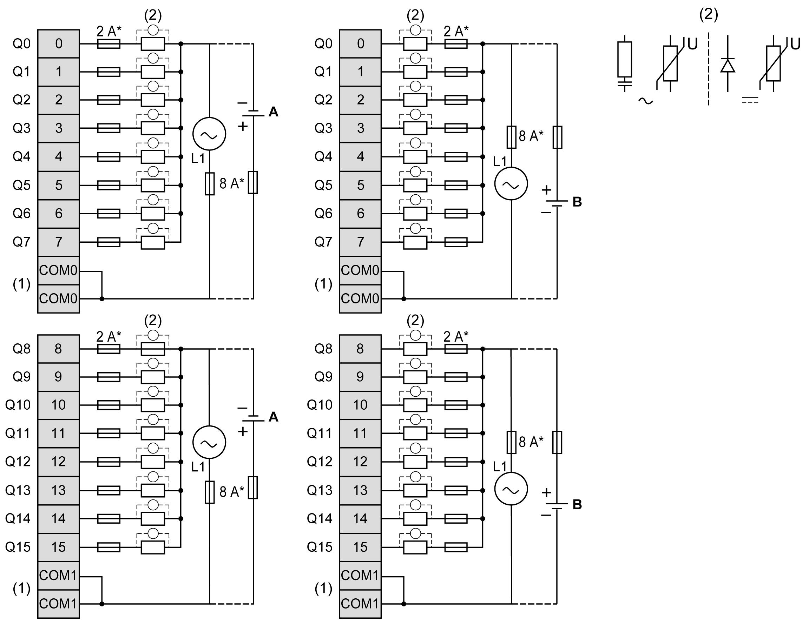

# TM3DQ16R / TM3DQ16RG Wiring Diagram

## Introduction

These expansion modules have a built-in removable screw or spring terminal block for the connection of the outputs and power supply.

## Wiring Rules

See [Wiring Best Practices](D-SE-0026685.html#D-SE-0026685).

## Wiring Diagram

The following figure illustrates the connections between the outputs, the actuators, and their commons:

**\*** Type T fuse

**(1)** The COM0 and COM1 terminals are **not** connected internally.

**(2)** To improve the life time of the contacts, and to protect from potential inductive load damage, connect a free wheeling diode in parallel to each inductive DC load or an RC snubber in parallel of each inductive AC load, or a varistor on either type of load.

**A** Source wiring (positive logic)

**B** Sink wiring (negative logic)

NOTE: When you use the TM3 expansion module with a TM3 Ethernet bus coupler, you must connect an RC snubber in parallel of each inductive AC load.

For information about 24 Vdc power supply, refer to [DC Power Supply Characteristics](D-SE-0037101.html#D-SE-0037101).

EIO0000003125.05