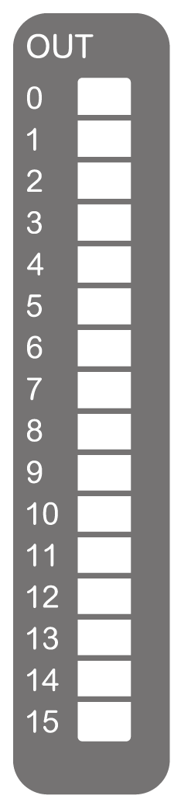

# TM3DQ16T / TM3DQ16TG Presentation

## Overview

TM3DQ16T (screw), TM3DQ16TG (spring) digital expansion module:

* 16 channels
* 0.5 A source outputs
* 1 common line
* Removable screw or spring terminal block

## Main Characteristics

| Characteristic | | Value |
| --- | --- | --- |
| Number of output channels | | 16 |
| Logic type | | Source |
| Rated output voltage | | 24 Vdc |
| Rated output current | | 0.5 A |
| Connection type | TM3DQ16T | Removable screw terminal blocks |
| TM3DQ16TG | Removable spring terminal blocks |
| Cable type and length | Type | Unshielded |
| Length | Maximum 30 m (98 ft) |
| Weight | | 110 g (3.90 oz) |

## Status LEDs

The following figures show the status LEDs:

This table describes the status LEDs:

| LED | Color | Status | Description |
| --- | --- | --- | --- |
| 0...15 | Green | On | The output channel is activated |
| Off | The output channel is deactivated |

EIO0000003125.05