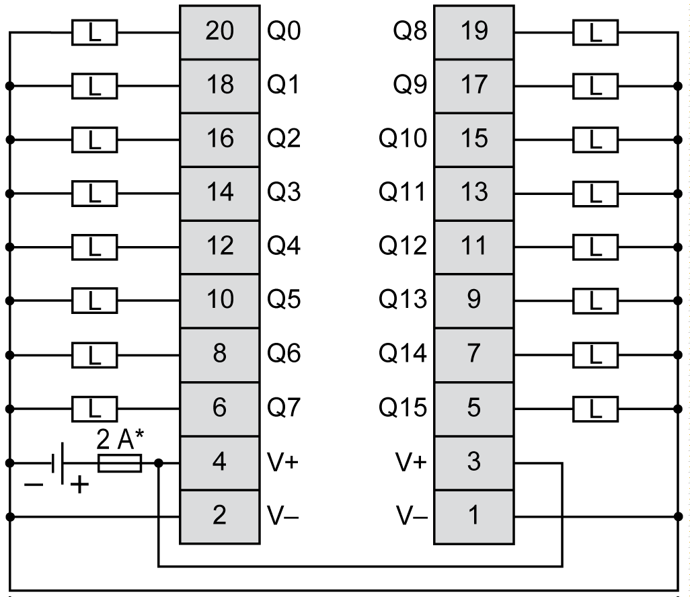

# TM3DQ16TK Wiring Diagram

## Introduction

This expansion module has a built-in HE10 (MIL 20) connector for the connection of outputs and power supply.

## Wiring Rules

See [Wiring Best Practices](D-SE-0026685.html#D-SE-0026685).

## Wiring Diagram with Free-Wire Cables

The following figure illustrates the connections between the outputs, the actuators, and their commons:

**\*** Type T fuse

For information about 24 Vdc power supply, refer to [DC Power Supply Characteristics](D-SE-0037101.html#D-SE-0037101).

For more information on the TWDFCW••K cable colors, refer to [TWDFCW••K Cable Description](D-SE-0025669.html#D-SE-0025669__D-SE-0025669.16).

EIO0000003125.05