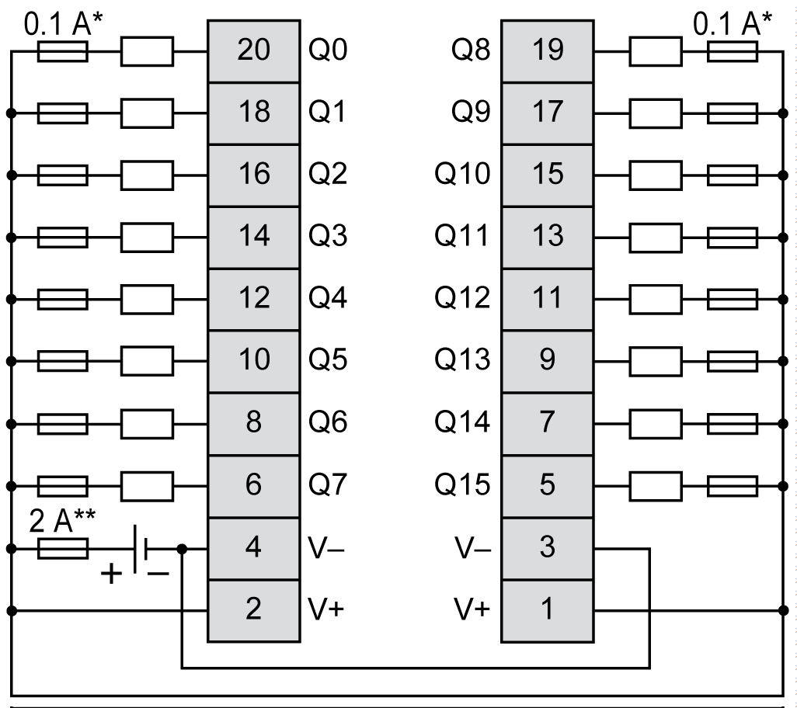

# TM3DQ16UK Wiring Diagram

## Introduction

These expansion modules have a built-in HE10 (MIL 20) connector for the connection of outputs and power supply.

Telefast sub-bases are not compatible with this module.

## Wiring Rules

See [Wiring Best Practices](D-SE-0026685.html#D-SE-0026685).

## Wiring Diagram

The following figure illustrates the connections between the outputs, the actuators, and their commons:

**\*** Type T fuse

**\*\*** Type F fuse

For information about 24 Vdc power supply, refer to [DC Power Supply Characteristics](D-SE-0037101.html#D-SE-0037101).

EIO0000003125.05