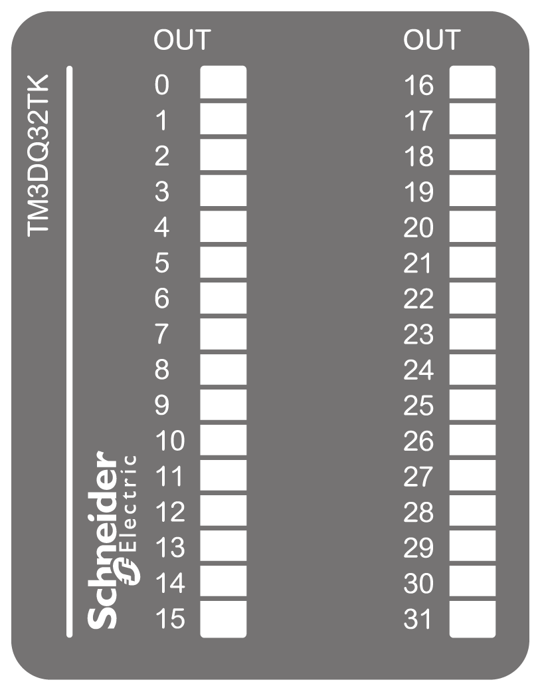

# TM3DQ32TK Presentation

## Overview

TM3DQ32TK (HE10) digital expansion module:

* 32 channels
* 0.1 A source outputs
* 2 common lines
* HE10 (MIL 20) connector

## Main Characteristics

| Characteristic | | Value |
| --- | --- | --- |
| Number of output channels | | 32 |
| Logic type | | Source |
| Rated output voltage | | 24 Vdc |
| Rated output current | | 0.1 A |
| Connection type | | HE10 (MIL 20) connectors |
| Cable type and length | Type | Unshielded |
| Length | Maximum 5 m (16 ft) |
| Weight | | 112 g (3.90 oz) |

## Status LEDs

The following figure shows the status LEDs:

This table describes the status LEDs:

| LED | Color | Status | Description |
| --- | --- | --- | --- |
| 0...31 | Green | On | The output channel is activated |
| Off | The output channel is deactivated |

EIO0000003125.05