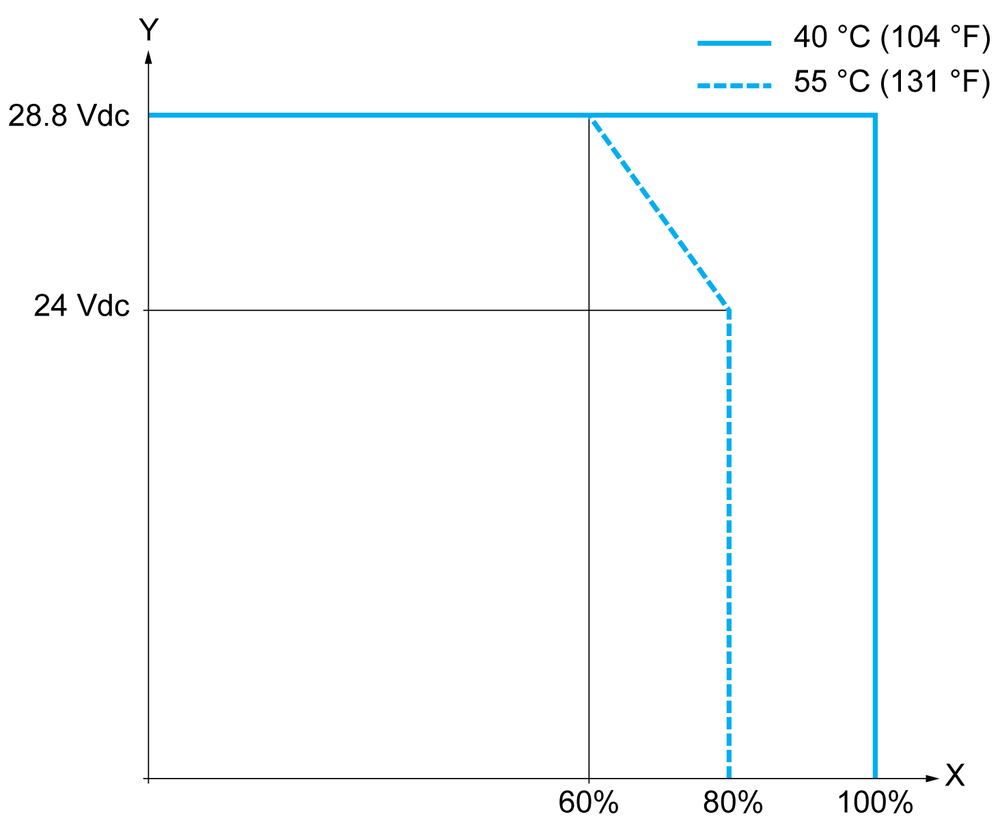

# TM3DM8R / TM3DM8RG Characteristics

## Introduction

This section describes the general characteristics of the TM3DM8R / TM3DM8RG expansion module.

See also [Environmental Characteristics](D-SE-0025238.html#D-SE-0025238).

| DANGER | |
| --- | --- |
|  | FIRE HAZARD  * Use only the correct wire sizes for the maximum current capacity of the I/O channels and power supplies. * For relay output (2 A) wiring, use conductors of at least 0.5 mm2 (AWG 20) with a temperature rating of at least 80 °C (176 °F). * For common conductors of relay output wiring (7 A), or relay output wiring greater than 2 A, use conductors of at least 1.0 mm2 (AWG 16) with a temperature rating of at least 80 °C (176 °F).  Failure to follow these instructions will result in death or serious injury. |

| WARNING | |
| --- | --- |
|  | UNINTENDED EQUIPMENT OPERATION  Do not exceed any of the rated values specified in the environmental and electrical characteristics tables.  Failure to follow these instructions can result in death, serious injury, or equipment damage. |

## Dimensions

The following diagrams show the external dimensions for the TM3DM8R / TM3DM8RG expansion modules:

**\*** 8.5 mm (0.33 in) when the clamp is pulled out.

## Input Characteristics

The table below describes the inputs characteristics of the TM3DM8R / TM3DM8RG:

| Characteristic | | Value | |
| --- | --- | --- | --- |
| Number of input channels | | 4 inputs | |
| Number of channels groups | | 1 common line for 4 channels | |
| Input type | | Type 1 (IEC/EN 61131-2) | |
| Logic type | | Sink/Source | |
| Rated input voltage | | 24 Vdc | |
| Input voltage range | | 0...28.8 Vdc | |
| Rated input current | | 7 mA | |
| Input impedance | | 3.4 kΩ | |
| Input limit values | Voltage at state 1 | > 15 Vdc (15...28.8 Vdc) | |
| Voltage at state 0 | < 5 Vdc (0...5 Vdc) | |
| Current at state 1 | > 2.5 mA | |
| Current at state 0 | < 1.0 mA | |
| Turn on time | | SV(1) < 2.0: 4 ms  SV(1) ≥ 2.0: 100 μs(2) | |
| Turn off time | |
| Isolation | Between input and internal logic | 500 Vac | |
| Between input group and output group | 1500 Vac | |
| Between input groups | N/A | |
| Connection type | TM3DM8R | Removable screw terminal block | |
| TM3DM8RG | Removable spring terminal block | |
| Connector insertion/removal durability | | Over 100 times | |
| Current draw on 5 Vdc internal bus | | 24 mA (all inputs and outputs on) | |
| 5 mA (all inputs and outputs off) | |
| Current draw on 24 Vdc internal bus | | 20 mA (all inputs and outputs on) | |
| 0 mA (all inputs and outputs off) | |
| **(1)** SV refers to the version and is printed on the product label.  **(2)** The range depends on the configured filter value. If you use EcoStruxure Machine Expert - Basic, refer to the Modicon TM3 (EcoStruxure Machine Expert - Basic) Expansion Modules Configuration - Programming Guide. If you use EcoStruxure Machine Expert, refer to the Modicon TM3 Expansion Modules - Programming Guide. | | | |

## Output Characteristics

The table below describes the outputs characteristics of the TM3DM8R / TM3DM8RG:

| Characteristic | | Value |
| --- | --- | --- |
| Number of output channels | | 4 outputs |
| Number of channel groups | | 1 common line for 4 channels |
| Output type | | Relay |
| Contact type | | NO (Normally Open) |
| Rated output voltage | | 24 Vdc, 240 Vac |
| Maximum voltage | | 30 Vdc, 264 Vac |
| Minimum switching load | | 5 Vdc at 10 mA |
| Rated output current | | 2 A |
| Maximum output current | | 2 A per output |
| 7 A per common |
| Maximum output frequency | | 20 operations per minute |
| Turn on time | | Maximum 10 ms |
| Turn off time | | Maximum 10 ms |
| Contact resitance | | 30 mΩ maximum |
| Mechanical life | | 20 million operations |
| Electrical life | Under resistive load | See [Power Limitation](#D-SE-0025010__D-SE-0025010.52) |
| Under inductive load |
| Protection against short circuit | | No |
| Isolation | Between input and internal logic | 500 Vac |
| Between input group and output group | 1500 Vac |
| Between input groups | N/A |
| Connection type | TM3DM8R | Removable screw terminal block |
| TM3DM8RG | Removable spring terminal block |
| Connector insertion/removal durability | | Over 100 times |
| Current draw on 5 Vdc internal bus | | 24 mA (all inputs and outputs on) |
| 5 mA (all inputs and outputs off) |
| Current draw on 24 Vdc internal bus | | 20 mA (all inputs and outputs on) |
| 0 mA (all inputs and outputs off) |
| NOTE: Refer to [Protecting Outputs from Inductive Load Damage](D-SE-0026685.html#D-SE-0026685) for additional information on this topic. | | |

## I/O De-rating

When using TM3DM8R / TM3DM8RG:

At an ambient temperature of 55 °C (131 °F) in the horizontal mounting direction, limit the inputs and outputs, respectively, which turn on simultaneously as indicated by the X axis.

At 40 °C (104 °F), all inputs and outputs can be turned on simultaneously at 28.8 Vdc.

## Power Limitation

This table describes the power limitation of the TM3DM8R / TM3DM8RG expansion module depending on the voltage, the type of load, and the number of operations required.

These expansion modules do not support capacitive loads.

| WARNING | |
| --- | --- |
|  | RELAY OUTPUTS WELDED CLOSED  * Always protect relay outputs from inductive alternating current load damage using an appropriate external protective circuit or device. * Do not connect relay outputs to capacitive loads.  Failure to follow these instructions can result in death, serious injury, or equipment damage. |

| Power Limitations | | | | |
| --- | --- | --- | --- | --- |
| **Voltage** | **24 Vdc** | **120 Vac** | **240 Vac** | **Number of operations** |
| Power of resistive loads  AC-12 | – | 240 VA  80 VA | 480 VA  160 VA | 100,000  300,000 |
| Power of inductive loads  AC-15 (cos ϕ = 0.35) | – | 60 VA  18 VA | 120 VA  36 VA | 100,000  300,000 |
| Power of inductive loads  AC-14 (cos ϕ = 0.7) | – | 120 VA  36 VA | 240 VA  72 VA | 100,000  300,000 |
| Power of resistive loads  DC-12 | 48 W  16 W | – | – | 100,000  300,000 |
| Power of inductive loads  DC-13 L/R = 7 ms | 24 W  7.2 W | – | – | 100,000  300,000 |

EIO0000003125.05