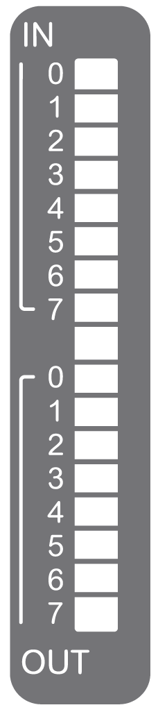

# TM3DM16R Presentation

## Overview

TM3DM16R digital expansion module:

* 8 channel 24 Vdc sink/source inputs
* 1 common line for inputs
* 8 channel 2 A relay outputs
* 2 common lines for outputs
* Removable screw terminal block

## Main Characteristics

| Characteristic | | Value | |
| --- | --- | --- | --- |
| **Input** | | | |
| Number of input channels | | 8 inputs | |
| Input type | | Type 1 (IEC/EN 61131-2) | |
| Input Logic type | | Sink/Source | |
| Rated input voltage | | 24 Vdc | |
| **Output** | | | |
| Number of output channels | | 8 outputs | |
| Output type | | Relay | |
| Contact type | | NO (Normally Open) | |
| Rated output voltage | | 24 Vdc / 240 Vac | |
| Rated output current | | 2 A | |
| **Connection and cable types** | | | |
| Connection type | | Removable screw terminal block | |
| Cable type and length | Type | Unshielded | |
| Length | Input: maximum 50 m (164 ft)  Output: maximum 150 m (492 ft) | |
| Weight | | 118 g (4.16 oz) | |

## Status LEDs

The following figure shows the status LEDs:

This table describes the status LEDs:

| LED | Color | Status | Type | Description |
| --- | --- | --- | --- | --- |
| 0...7 | Green | On | Input | The channel is activated |
| Off | The channel is deactivated |
| 0...7 | Green | On | Output | The channel is activated |
| Off | The channel is deactivated |

EIO0000003125.05