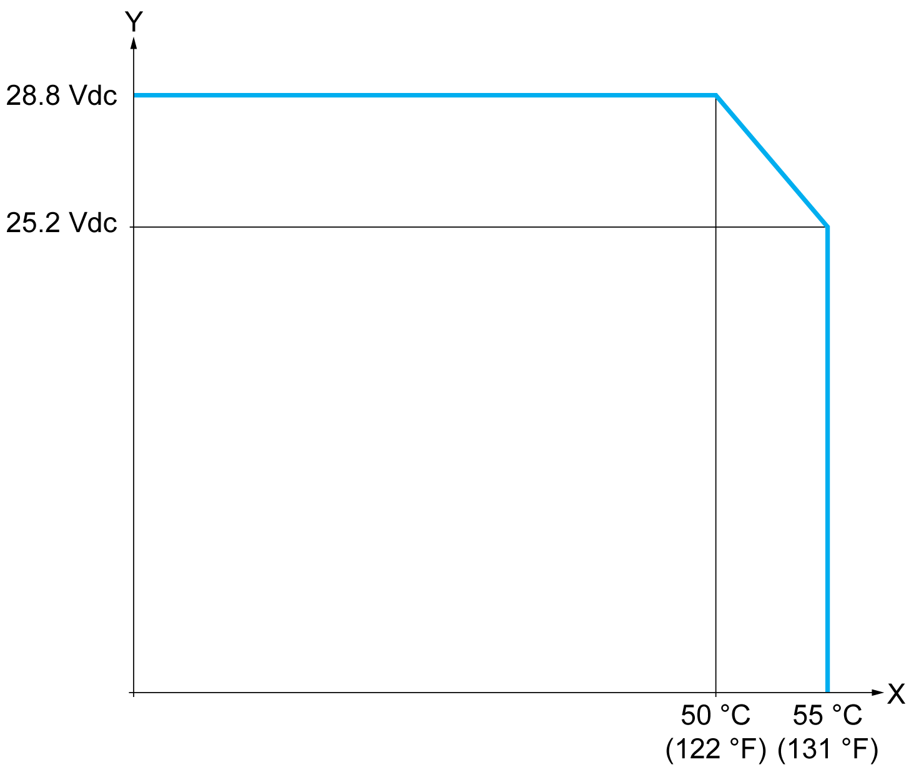
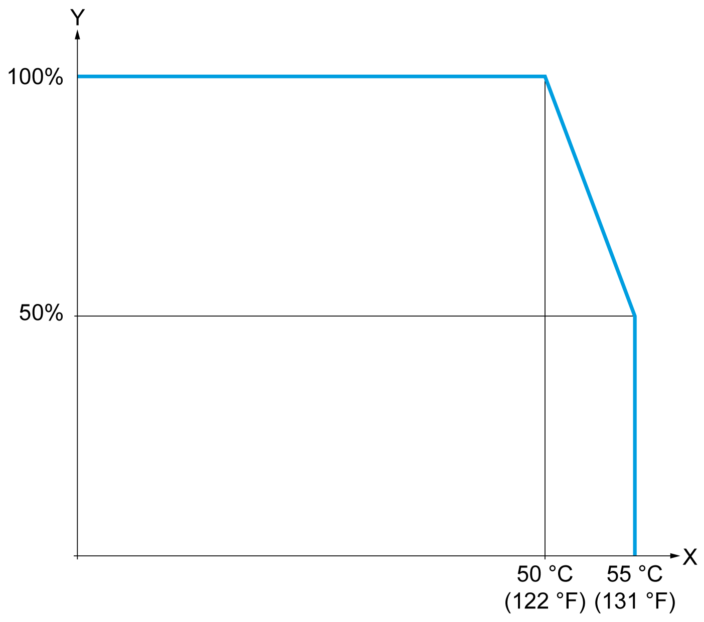

# TM3DM16R Characteristics

## Introduction

This section describes the general characteristics of the TM3DM16R expansion module.

See also [Environmental Characteristics](D-SE-0025238.html#D-SE-0025238).

| DANGER | |
| --- | --- |
|  | FIRE HAZARD  * Use only the correct wire sizes for the maximum current capacity of the I/O channels and power supplies. * For relay output (2 A) wiring, use conductors of at least 0.5 mm2 (AWG 20) with a temperature rating of at least 80 °C (176 °F). * For common conductors of relay output wiring (7 A), or relay output wiring greater than 2 A, use conductors of at least 1.0 mm2 (AWG 16) with a temperature rating of at least 80 °C (176 °F).  Failure to follow these instructions will result in death or serious injury. |

| WARNING | |
| --- | --- |
|  | UNINTENDED EQUIPMENT OPERATION  Do not exceed any of the rated values specified in the environmental and electrical characteristics tables.  Failure to follow these instructions can result in death, serious injury, or equipment damage. |

## Dimensions

The following diagrams show the external dimensions for the TM3DM16R expansion modules:

**\*** 8.5 mm (0.33 in) when the clamp is pulled out.

## Input Characteristics

The table below describes the input characteristics of the TM3DM16R:

| Characteristic | | Value | |
| --- | --- | --- | --- |
| Number of input channels | | 8 inputs | |
| Number of channels groups | | 1 common line for 8 channels | |
| Input type | | Type 1 (IEC/EN 61131-2) | |
| Logic type | | Sink/Source | |
| Rated input voltage | | 24 Vdc | |
| Input voltage range | | 0...28.8 Vdc | |
| Rated input current | | 5 mA | |
| Input impedance | | 4.7 kΩ | |
| Input limit values | Voltage at state 1 | > 15 Vdc (15...28.8 Vdc) | |
| Voltage at state 0 | < 5 Vdc (0...5 Vdc) | |
| Current at state 1 | > 2.5 mA | |
| Current at state 0 | < 1.5 mA | |
| Turn on time | | 4 ms | |
| Turn off time | | 4 ms | |
| De-rating | 0...55 °C  (32...131 °F) | See [Input de-rating](#Characteristics-2C251343__InputDe-rating-2C89C2E4) | |
| Isolation | Between input and internal logic | 500 Vac / 800 Vdc | |
| Between input group and output group | 1500 Vac / 2500 Vdc | |
| Between input groups | N/A | |
| Connection type | | Removable screw terminal block | |
| Connector insertion/removal durability | | Over 100 times | |
| Current draw on 5 Vdc internal bus | | 70 mA | |
| Current draw on 24 Vdc internal bus | | 40 mA | |

## Output Characteristics

The table below describes the outputs characteristics of the TM3DM16R:

| Characteristic | | Value |
| --- | --- | --- |
| Number of output channels | | 8 outputs |
| Number of channel groups | | 2 common lines for 8 channels |
| Output type | | Relay |
| Contact type | | NO (Normally Open) |
| Rated output voltage | | 24 Vdc, 220 Vac |
| Maximum voltage | | 30 Vdc, 250 Vac |
| Rated output current | | 2 A per output |
| Maximum output current | | 2 A per output  4 A per common |
| Maximum output frequency | With maximum load | 0.1 Hz |
| Without load | 5 Hz |
| Turn on time | | Maximum 10 ms |
| Turn off time | | Maximum 10 ms |
| De-rating | 0...55 °C  (32...131 °F) | See [Output de-rating](#Characteristics-2C251343__OutputDe-rating-2C89C56E) |
| Mechanical life | | 20 million operations |
| Electrical life under resistive load 2 A | | 100,000 switching cycles at 45 °C (113 °F) |
| Protection against short circuit | | No |
| Isolation | Between output and internal logic | 1500 Vac / 2500 Vdc |
| Between input group and output group | 1500 Vac / 2500 Vdc |
| Between output groups | 1500 Vac / 2500 Vdc |
| Connection type | | Removable screw terminal block |
| Connector insertion/removal durability | | Over 100 times |
| Current draw on 5 Vdc internal bus | | 70 mA |
| Current draw on 24 Vdc internal bus | | 40 mA |
| NOTE: Refer to [Protecting Outputs from Inductive Load Damage](D-SE-0026685.html#D-SE-0026685) for additional information on this topic. | | |

## Input De-rating

When using TM3DM16R:

**X** Ambient temperature (°C / °F)

**Y** Input voltage (V)

At an ambient temperature of 55 °C (131 °F) in the horizontal mounting direction, limit the inputs and outputs, respectively, which turn on simultaneously as indicated by the X axis.

## Output De-rating

When using TM3DM16R:

**X** Ambient temperature (°C / °F)

**Y** Output load current (%)

## Power Limitation

This table describes the power limitation of the TM3DM16R expansion module depending on the voltage, the type of load, and the number of operations required.

These expansion modules do not support capacitive loads.

| WARNING | |
| --- | --- |
|  | RELAY OUTPUTS WELDED CLOSED  * Always protect relay outputs from inductive alternating current load damage using an appropriate external protective circuit or device. * Do not connect relay outputs to capacitive loads.  Failure to follow these instructions can result in death, serious injury, or equipment damage. |

| Power Limitations | | | | |
| --- | --- | --- | --- | --- |
| **Voltage** | **24 Vdc** | **120 Vac** | **240 Vac** | **Number of operations** |
| Power of resistive loads  AC-12 | – | 240 VA  80 VA | 480 VA  160 VA | 100,000  300,000 |
| Power of inductive loads  AC-15 (cos ϕ = 0.35) | – | 60 VA  18 VA | 120 VA  36 VA | 100,000  300,000 |
| Power of inductive loads  AC-14 (cos ϕ = 0.7) | – | 120 VA  36 VA | 240 VA  72 VA | 100,000  300,000 |
| Power of resistive loads  DC-12 | 48 W  16 W | – | – | 100,000  300,000 |
| Power of inductive loads  DC-13 L/R = 7 ms | 24 W  7.2 W | – | – | 100,000  300,000 |

EIO0000003125.05