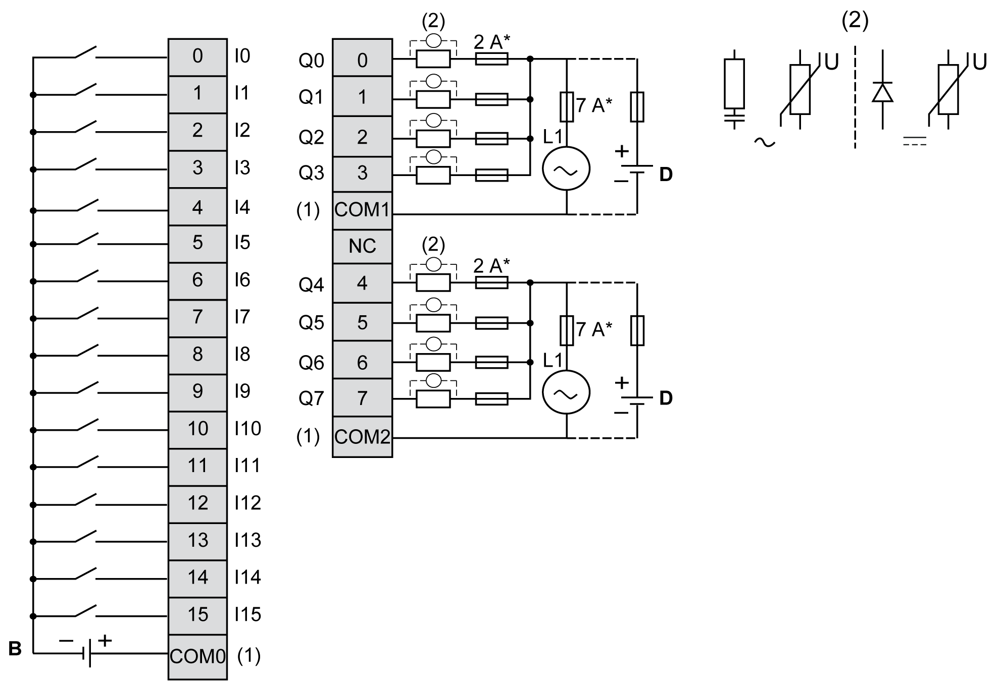

# TM3DM24R / TM3DM24RG Wiring Diagram

## Introduction

These expansion modules have a built-in removable screw or spring terminal block for the connection of inputs, outputs, and power supply.

## Wiring Rules

See [Wiring Best Practices](D-SE-0026685.html#D-SE-0026685).

## Wiring Diagram

The following figure illustrates the connections between the inputs and outputs, the sensors and actuators, and their commons for a positive logic:

**\*** Type T Fuse

**(1)** The COM0, COM1 and COM2 terminals are **not** connected internally.

**(2)** To improve the life time of the contacts, and to protect from potential inductive load damage, connect a free wheeling diode in parallel to each inductive DC load or an RC snubber in parallel of each inductive AC load, or a varistor on either type of load.

**C** Source wiring (positive logic)

NOTE: When you use the TM3 expansion module with a TM3 Ethernet bus coupler, you must connect an RC snubber in parallel of each inductive AC load.

The following figure illustrates the connections between the inputs and outputs, the sensors and actuators, and their commons for a negative logic:

**\*** Type T Fuse

**(1)** The COM0, COM1 and COM2 terminals are **not** connected internally.

**(2)** To improve the life time of the contacts, and to protect from potential inductive load damage, connect a free wheeling diode in parallel to each inductive DC load or an RC snubber in parallel of each inductive AC load, or a varistor on either type of load.

**D** Sink wiring (negative logic)

NOTE: When you use the TM3 expansion module with a TM3 Ethernet bus coupler, you must connect an RC snubber in parallel of each inductive AC load.

For information about 24 Vdc power supply, refer to [DC Power Supply Characteristics](D-SE-0037101.html#D-SE-0037101).

| WARNING | |
| --- | --- |
|  | UNINTENDED EQUIPMENT OPERATION  Do not connect wires to unused terminals and/or terminals indicated as “No Connection (N.C.)”.  Failure to follow these instructions can result in death, serious injury, or equipment damage. |

EIO0000003125.05