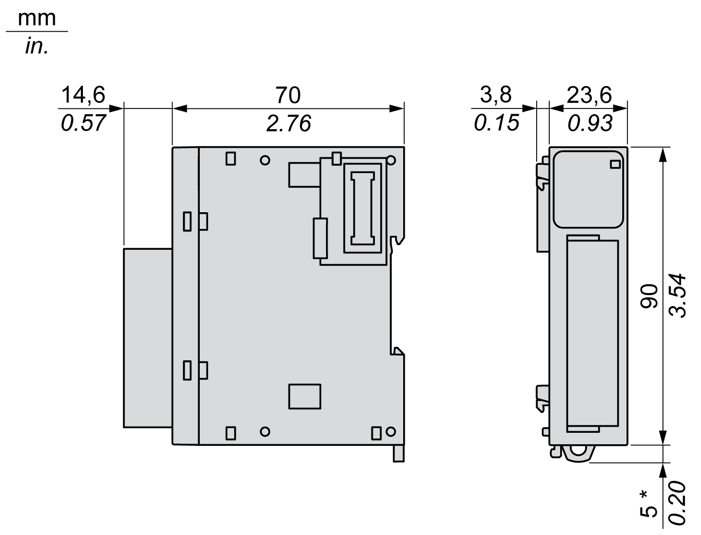

# TM3AI2H / TM3AI2HG Characteristics

## Introduction

This section provides a general description of the characteristics of the TM3AI2H / TM3AI2HG expansion modules.

See also [Environmental Characteristics](D-SE-0025238.html#D-SE-0025238).

| WARNING | |
| --- | --- |
|  | UNINTENDED EQUIPMENT OPERATION  Do not exceed any of the rated values specified in the environmental and electrical characteristics tables.  Failure to follow these instructions can result in death, serious injury, or equipment damage. |

## Dimensions

The following diagrams show the external dimensions for the TM3AI2H / TM3AI2HG expansion modules:

\* 8.5 mm (0.33 in.) when the clamp is pulled out.

## General Characteristics

| Characteristics | Value |
| --- | --- |
| Rated power supply voltage | 24 Vdc |
| Power supply range | 20.4...28.8 Vdc |
| Connector insertion/removal durability | 100 times minimum |
| Current draw on 5 Vdc internal bus | 30 mA (no load)  30 mA (full load) |
| Current draw on 24 Vdc internal bus | 0 mA |
| Current draw on external 24 Vdc | 25 mA (no load)  25 mA (full load) |

## Input Characteristics

The following table describes the input characteristics of the TM3AI2H / TM3AI2HG expansion modules:

| Characteristics | | Value | |
| --- | --- | --- | --- |
| Voltage input | Current input |
| Input range | | 0...10 Vdc  –10...+10 Vdc | 0...20 mA  4...20 mA |
| Input impedance | | 1 MΩ minimum | 50 Ω maximum |
| Sample duration time | | 1 ms per enabled channel | |
| Input type | | Single-ended input | |
| Operating mode | | Self-scan | |
| Conversion mode | | Sigma delta ADC | |
| Maximum accuracy at ambient 25 °C (77 °F) | | ±0.1 % of full scale | |
| Temperature drift | | ±0.006 % of full scale | |
| Repeatability after stabilization time | | ±0.5 % of full scale | |
| Nonlinearity | | ±0.01 % of full scale | |
| Maximum input deviation | | ±1.0 % of full scale | |
| Resolution | | 16 bits, or 15 bits + sign (65536 points) | |
| Input value of LSB | | 0.153 mV (range 0...10 Vdc)  0.305 mV (range –10...+10 Vdc) | 0.305 µA (range 0...20 mA)  0.244 µA (range 4...20 mA) |
| Data type in application program | | Scalable from –32768 to 32767 | |
| Input data out of range detection | | Yes | |
| Noise resistance | Maximum temporary deviation during perturbations | ±4 % maximum when EMC perturbation is applied to the power and I/O wiring | |
| Cable | Twisted-pair shielded cable, maximum 30 m | |
| Crosstalk | 1 LSB maximum | |
| Isolation | Between external power supply and inputs | 1500 Vac | |
| Between inputs and internal logic circuits | 500 Vac | |
| Maximum continuous allowed overload (no damage) | | 13 Vdc | 40 mA |
| Input filter | | Software filter: 0...10 s (per 0.01 s unit) | |
| Behavior when external power is off | | Input value is 0.  The external power supply error status bit in the controller is ON. | |

EIO0000003131.04