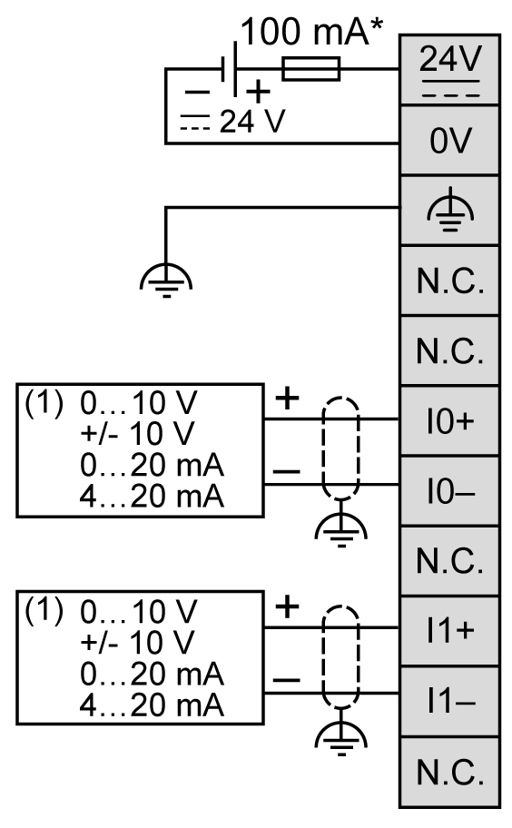

# TM3AI2H / TM3AI2HG Wiring Diagram

## Introduction

This expansion module has a built-in removable screw terminal block for the connection of inputs and power supply.

NOTE: Loop powered sensors are not supported by these expansion modules. The modules do not provide loop power when wired for current.

## Wiring Rules

See [Wiring Best Practices](D-SE-0026685.html#D-SE-0026685).

## Wiring Diagram

The following figure illustrates the connection between the inputs, the sensors, and their commons:

**\*** Type T fuse

**(1)** Current/Voltage analog output device

| WARNING | |
| --- | --- |
|  | UNINTENDED EQUIPMENT OPERATION  Do not connect wires to unused terminals and/or terminals indicated as “No Connection (N.C.)”.  Failure to follow these instructions can result in death, serious injury, or equipment damage. |

EIO0000003131.04