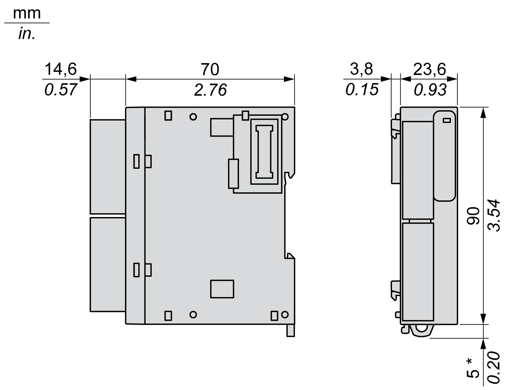

# TM3TI4 / TM3TI4G Characteristics

## Introduction

This section provides a description of the input characteristics of TM3TI4 / TM3TI4G expansion modules.

See also [Environmental Characteristics](D-SE-0025238.html#D-SE-0025238).

| WARNING | |
| --- | --- |
|  | UNINTENDED EQUIPMENT OPERATION  Do not exceed any of the rated values specified in the environmental and electrical characteristics tables.  Failure to follow these instructions can result in death, serious injury, or equipment damage. |

## Dimensions

The following diagrams show the external dimensions for the TM3TI4 / TM3TI4G expansion modules:

\* 8.5 mm (0.33 in.) when the clamp is pulled out.

## General Characteristics

| Characteristics | Value |
| --- | --- |
| Rated power supply voltage | 24 Vdc |
| Power supply range | 20.4...28.8 Vdc |
| Connector insertion/removal durability | 100 times minimum |
| Current draw on 5 Vdc internal bus | 40 mA (no load)  40 mA (full load) |
| Current draw on 24 Vdc internal bus | 0 mA |
| Current draw on external 24 Vdc | 35 mA (no load)  40 mA (full load) |

## Input Characteristics

The following table describes the input characteristics of the TM3TI4 / TM3TI4G expansion modules:

| Characteristics | | Value | | | | | |
| --- | --- | --- | --- | --- | --- | --- | --- |
| Voltage input | Current input | Thermocouple type | | 3-wire-RTD | |
| Input range | | 0...10 Vdc  –10...+10 Vdc | 0...20 mA  4...20 mA | K | –200...1300 °C  (–328...2372 °F) | PT100 | –200...850 °C  (–328...1562 °F) |
| J | –200...1000 °C  (–328...1832 °F) | PT1000 | –200...600 °C  (–328...1112 °F) |
| R | 0...1760 °C  (32...3200 °F) | NI100 | –60...180 °C  (–76...356 °F) |
| S | 0...1760 °C  (32...3200 °F) | NI 1000 | –60...180 °C  (–76...356 °F) |
| B | 0...1820 °C  (32...3308 °F) | – | |
| E | –200...800 °C  (–328...1472 °F) |
| T | –200...400 °C  (–328...752 °F) |
| N | –200...1300 °C  (–328...2372 °F) |
| C | 0...2315 °C  (32...4199 °F) |
| Input impedance | | 1 MΩ minimum | 50 Ω maximum | 1 MΩ minimum | | | |
| Sample duration time (software configurable) | | 10 ms or 100 ms per enabled channel | | 100 ms per enabled channel | | | |
| Input type | | Single-ended input. Use only isolated thermocouples. All the shields of the sensor cables must be referenced to the logic controller ground. | | | | | |
| Operating mode | | Self-scan | | | | | |
| Conversion mode | | Sigma delta ADC | | | | | |
| Maximum accuracy at ambient 25 °C (77 °F) | | ±0.2 % of full scale | | | | | |
| – | | Cold junction accuracy ±4.0 °C (±7.2 °F) | | – | |
| except: | |
| R  S | ±6.0 °C (0...200 °C) (±10.8 °F (32...392 °F)) |
| B | Not available (0...300 °C (32...572 °F)) |
| K  J  E  T  N | ±0.4 % of full scale under 0 °C (32 °F) |
| Temperature drift | | ±0.01 % of full scale | | | | | |
| Repeatability after stabilization time | | ±0.5 % of full scale | | | | | |
| Nonlinearity | | ±0.2 % of full scale | | | | | |
| Maximum input deviation | | ±1.0 % of full scale | | | | | |
| Resolution | | 16 bits, or 15 bits + sign (65536 points) | | K  J  R  S  B  E  T  N  C | 15000 points  12000 points  17600 points  17600 points  18200 points  10000 points  6000 points  15000 points  23150 points | PT100  PT1000  NI100  NI1000 | 10500 points  8000 points  2400 points  2400 points |
| Input value of LSB | | 0.153 mV (range 0...10 Vdc)  0.305 mV (range –10...+10 Vdc) | 0.305 µA (range 0...20 mA)  0.244 µA (range 4...20 mA) | 0.1 °C (0.18 °F) | | | |
| Data type in application program | | Scalable from –32768 to 32767 | | | | | |
| Input data out of range detection | | Yes | | | | | |
| Noise resistance | Maximum temporary deviation during perturbations | ±4 % maximum when EMC perturbation is applied to the power and I/O wiring | | | | | |
| Cable | Twisted-pair shielded cable | | | | | |
| Crosstalk | 1 LSB maximum | | | | | |
| Isolation | Between external power supply and inputs | 1500 Vac | | | | | |
| Between inputs and internal logic circuits | 500 Vac | | | | | |
| Between inputs | Not isolated | | | | | |
| Maximum continuous allowed overload (no damage) | | 13 Vdc | 40 mA | N/A | | | |
| Input filter | | Software filter: 0...10 s (per 0.01 s unit) | | | | | |
| Behavior when temperature sensor is broken | | N/A | | Input value is highest limit value.  Highest limit flag is ON. | | | |
| Behavior when external power is off | | Input value is 0. | | Input value is highest limit value. | | | |
| The external power supply error status bit in the controller is ON. | | | | | |

EIO0000003131.04