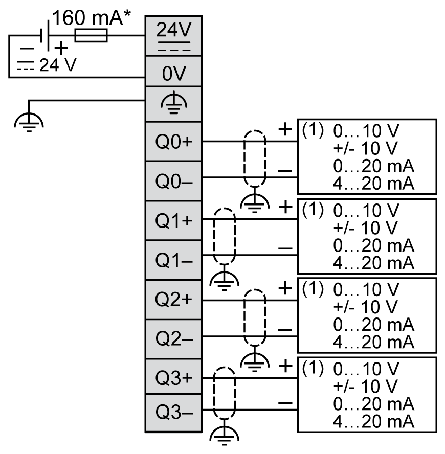

# TM3AQ4 / TM3AQ4G Wiring Diagram

## Introduction

These expansion modules have a built-in removable screw or spring terminal block for the connection of outputs and power supply.

## Wiring Rules

See [Wiring Best Practices](D-SE-0026685.html#D-SE-0026685).

## Wiring Diagram

The following figure illustrates the connection between the outputs, the actuators, and their commons:

**\*** Type T fuse

**(1)** Current/Voltage analog input device

EIO0000003131.04