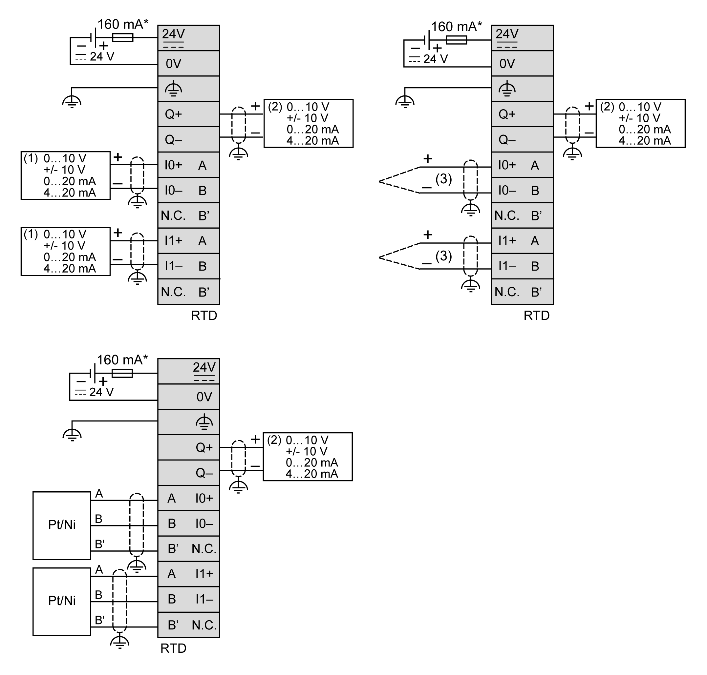

# TM3TM3 / TM3TM3G Wiring Diagram

## Introduction

These expansion modules have a built-in removable screw or spring terminal block for the connection of inputs, outputs, and power supply.

## Wiring Rules

See [Wiring Best Practices](D-SE-0026685.html#D-SE-0026685).

## Wiring Diagram

The following figure illustrates the connections between the inputs and outputs, the sensors and actuators, and their commons:

**\*** Type T fuse

**(1)** Current/Voltage analog output device

**(2)** Current/Voltage analog input device

**(3)** Thermocouple

| WARNING | |
| --- | --- |
|  | UNINTENDED EQUIPMENT OPERATION  Do not connect wires to unused terminals and/or terminals indicated as “No Connection (N.C.)”.  Failure to follow these instructions can result in death, serious injury, or equipment damage. |

EIO0000003131.04