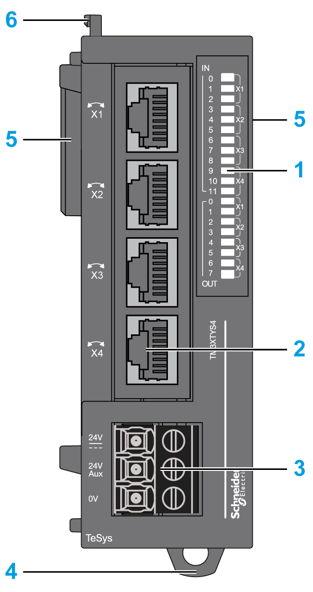
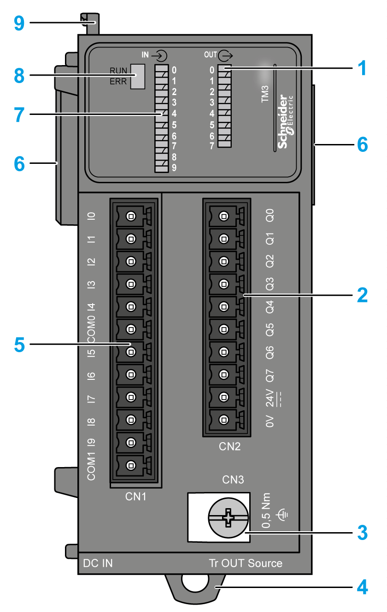

# Physical Description

## Introduction

This section describes the physical characteristics of the TM3 expert expansion modules.

## TeSys Modules

The following figure shows the main elements of the TM3XTYS4 expansion module:

This table describes the main elements of the TM3XTYS4 expansion module shown above:

| N° | Description | Refer to |
| --- | --- | --- |
| 1 | LEDs for displaying the state of the I/O channels | – |
| 2 | TeSys RJ45 connectors | – |
| 3 | Power supply screw terminal block | [Power Supply Wiring diagram](D-SE-0028634.html#D-SE-0028634__D-SE-0028634.7) |
| 4 | Clip-on lock for 35 mm (1.38 in.) top hat section rail (DIN-rail) | [Top Hat Section Rail (DIN rail)](TopHatSectionRailDINRail-8CC2B316.html) |
| 5 | Expansion connector for TM3 I/O bus (one on each side) | – |
| 6 | Locking device for attachment to the previous module | – |

## High Speed Counting Modules

The following figure shows the main elements of a TM3X•HSC202• expansion module:

This table describes the main elements of the TM3X•HSC202• expansion module shown above:

| N° | Description | Refer to |
| --- | --- | --- |
| 1 | LEDs for displaying the state of the output channels | – |
| 2 | Removable outputs terminal block (screw or spring) | [Wiring Best Practices](D-SE-0026685.html) |
| 3 | Functional ground screw | [Grounding the TM3 Expert I/O Modules](Grounding-9BB6A8A7.html) |
| 4 | Clip-on lock for 35 mm (1.38 in.) top hat section rail (DIN rail) | [Top Hat Section Rail (DIN rail)](TopHatSectionRailDINRail-8CC2B316.html) |
| 5 | Removable inputs terminal block (screw or spring) | [Wiring Best Practices](D-SE-0026685.html) |
| 6 | Expansion connector for TM3 I/O bus (one on each side) | – |
| 7 | LEDs for displaying the state of the input channels | – |
| 8 | Module status LEDs | – |
| 9 | Locking device for attachment to the previous module | – |

EIO0000003137.04