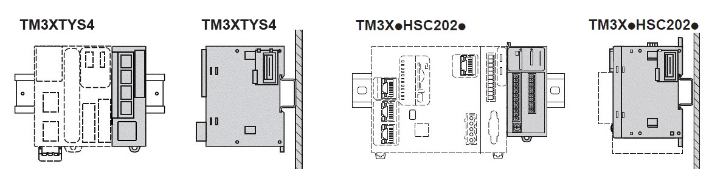
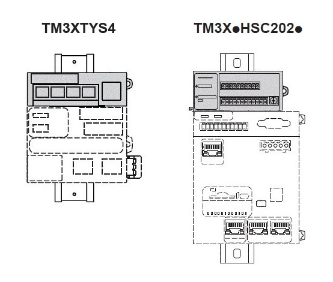
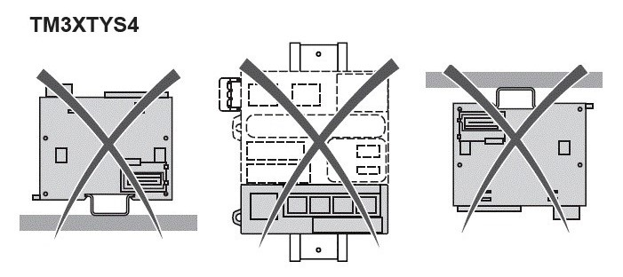
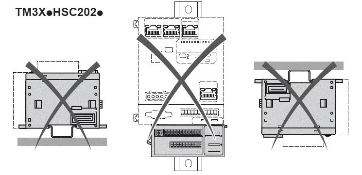

# Installation Guidelines

## Introduction

TM3 expansion modules are assembled by connecting them to a logic controller or receiver module.

The logic controller or receiver module and their expansion modules can be installed on a top hat section rail (DIN rail).

## Mounting Position and Minimum Clearances

The mounting position and minimum clearances of the expansion modules must conform with the rules defined for the appropriate hardware system. Refer to the *Installation chapter* in the *Controller Hardware* documentation for your specific controller.

| WARNING | |
| --- | --- |
|  | UNINTENDED EQUIPMENT OPERATION  * Place devices dissipating the most heat at the top of the cabinet and ensure adequate ventilation. * Avoid placing this equipment next to or above devices that might cause overheating. * Install the equipment in a location providing the minimum clearances from all adjacent structures and equipment as directed in this document. * Install all equipment in accordance with the specifications in the related documentation.  Failure to follow these instructions can result in death, serious injury, or equipment damage. |

## Correct Mounting Position

To obtain optimal operating characteristics, the TM3 Expert I/O Modules should be mounted horizontally on a vertical plane as shown in the figure below:

## Acceptable Mounting Position

The TM3 Expert I/O Modules can also be mounted vertically on a vertical plane as shown below:

## Incorrect Mounting Positions

The TM3 Expert I/O Modules should only be positioned as shown in the [Correct Mounting Position](#D-SE-0025973__CorrectMountingPosition-CB19C443) figure. The figures below show the incorrect mounting positions:

EIO0000003137.04