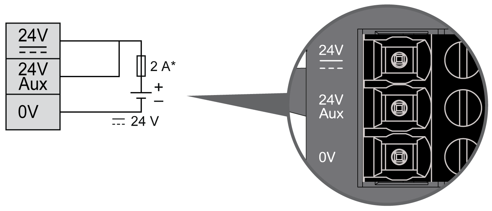

# DC Power Supply Characteristics

## Overview

The TM3 expert I/O expansion modules require a power supply with a nominal voltage of 24 Vdc. The 24 Vdc power supply must be rated Protective Extra Low Voltage (PELV) according to IEC 61140. This power supply is isolated between the electrical input and output circuits of the power supply.

| WARNING | |
| --- | --- |
|  | POTENTIAL OF OVERHEATING AND FIRE  * Do not connect the equipment directly to line voltage. * Use only isolating PELV power supplies and circuits to supply power to the equipment1.  Failure to follow these instructions can result in death, serious injury, or equipment damage. |

1 For compliance to UL (Underwriters Laboratories) requirements, the power supply must also conform to the various criteria of NEC Class 2, and be inherently current limited to a maximum power output availability of less than 100 VA (approximately 4 A at nominal voltage), or not inherently limited but with an additional protection device such as a circuit breaker or fuse meeting the requirements of clause 9.4 Limited-energy circuit of UL 61010-1. In all cases, the current limit should never exceed that of the electric characteristics and wiring diagrams for the equipment described in the present documentation. In all cases, the power supply must be grounded, and you must separate Class 2 circuits from other circuits. If the indicated rating of the electrical characteristics or wiring diagrams are greater than the specified current limit, multiple Class 2 power supplies may be used.

## DC Power Supply Wiring Diagram

This section applies **only** to TM3XTYS4 expansion modules. It is not valid for TM3X•HSC202• expansion modules.

The following figure shows the wiring of the DC power supply:

**\*** Type T fuse

24 Vdc Aux is dedicated to input power supply.

24 Vdc is dedicated to output power supply.

EIO0000003137.04