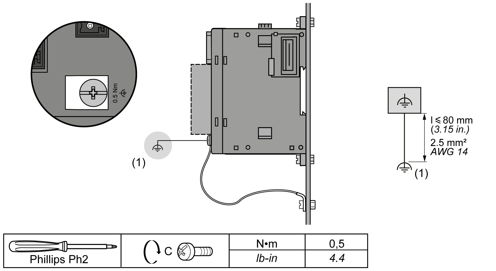
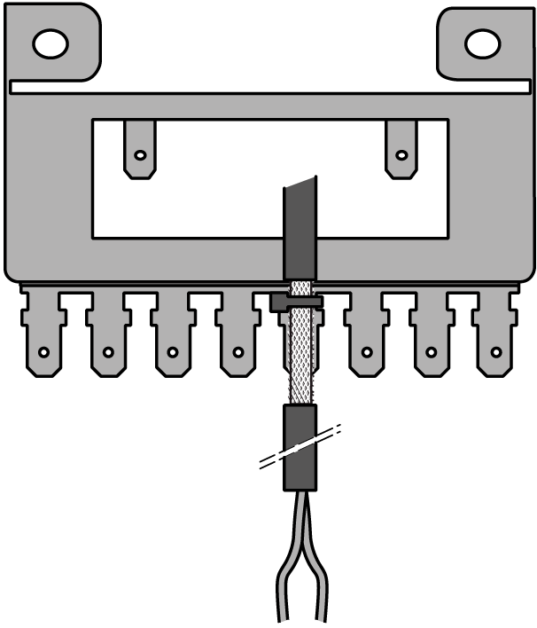
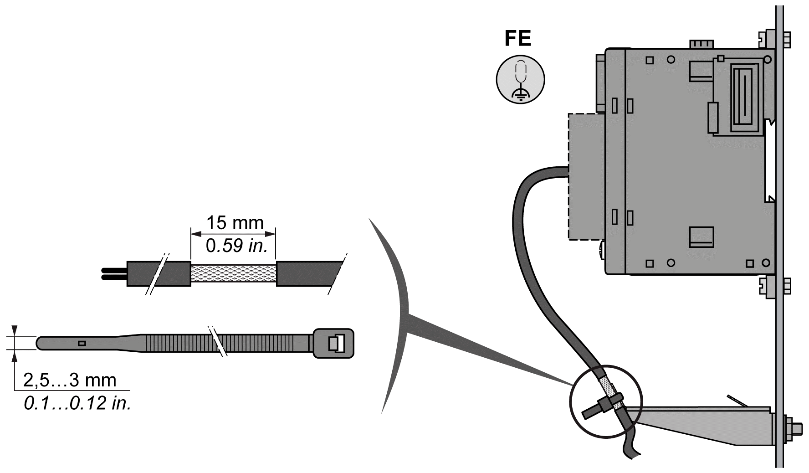

# Grounding the TM3 Expert I/O Modules

## Overview

Due to the effects of electromagnetic interference, cables carrying fast I/O, analog I/O, and the fieldbus communication signals must be shielded.

| WARNING | |
| --- | --- |
|  | UNINTENDED EQUIPMENT OPERATION  * Use shielded cables for all fast I/O, analog I/O, and communication signals. * Ground cable shields for all fast I/O, analog I/O, and communication signals at a single point1. * Route communications and I/O cables separately from power cables.  Failure to follow these instructions can result in death, serious injury, or equipment damage. |

1Multipoint grounding is permissible if connections are made to an equipotential ground plane dimensioned to help avoid cable shield damage in the event of power system short-circuit currents.

The  use of shielded cables requires compliance with the following wiring rules:

* For protective earth ground connections (PE), metal conduit or ducting can be used for part of the shielding length, provided there is no break in the continuity of the ground connections. For functional earth ground (FE), the shielding is intended to attenuate electromagnetic interference and the shielding must be continuous for the length of the cable. If the purpose is both functional and protective, as is often the case for communication cables, the cable must have continuous shielding.
* Wherever possible, keep cables carrying one type of signal separate from the cables carrying other types of signals or power.

## Shielded Cables Connections

Cables carrying fast I/O, analog I/O, and the fieldbus communication signals must be shielded. The shielding must be securely connected to ground. Fast I/O and analog I/O shields may be connected either to the functional earth ground (FE) or to the protective earth ground (PE) of your TM3 expansion module. The fieldbus communication cable shields must be connected to the protective earth ground (PE) with a connecting clamp secured to the conductive backplane of your installation.

## Protective Earth Ground (PE) on the Backplane

The protective earth ground (PE) is connected to the conductive backplane by a heavy-duty wire, usually a braided copper cable with the maximum allowable cable section.

## Functional Earth Ground (FE) on the DIN Rail

The DIN Rail for your TM3 system is common with the functional earth ground (FE) plane and must be mounted on a conductive backplane.

| WARNING | |
| --- | --- |
|  | UNINTENDED EQUIPMENT OPERATION  Connect the DIN rail to the functional earth ground (FE) of your installation.  Failure to follow these instructions can result in death, serious injury, or equipment damage. |

## Functional Earth Ground (FE) Connections

This section applies **only** to TM3X•HSC202• expansion modules. It is not valid for TM3XTYS4 expansion modules.

The following diagram shows how to wire the screw to the functional earth ground (FE):

**(1)** Functional earth ground (FE)

Applying torque above the limit may damage the terminal screw or threads.

| NOTICE | |
| --- | --- |
|  | INOPERABLE EQUIPMENT  Do not tighten screw terminals beyond the specified maximum torque (N•m / lb-in.).  Failure to follow these instructions can result in equipment damage. |

The following diagram shows how to connect the input and output cable shielding to the functional earth ground (FE):

NOTE: The power supply wiring must be kept as short as possible.

EIO0000003137.04