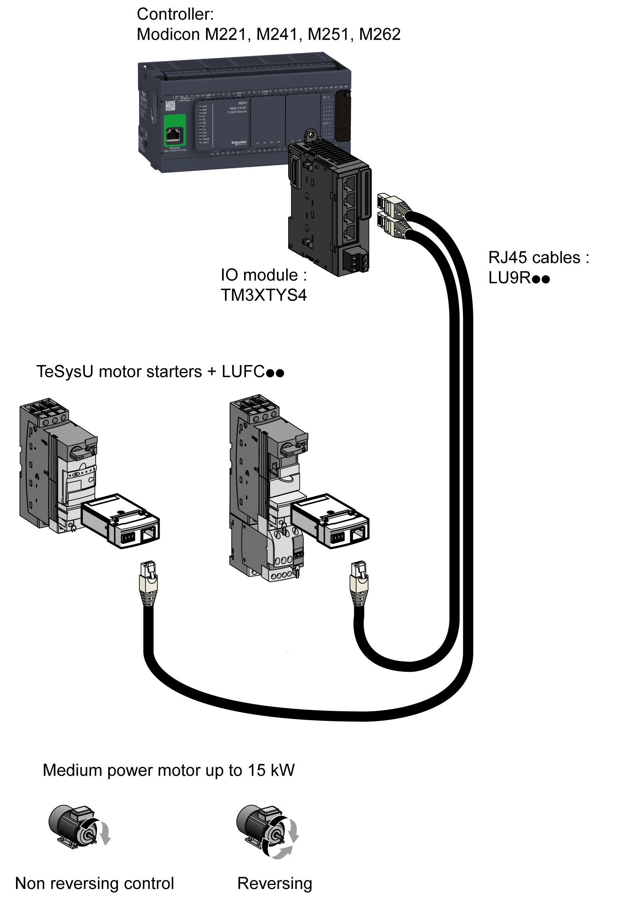
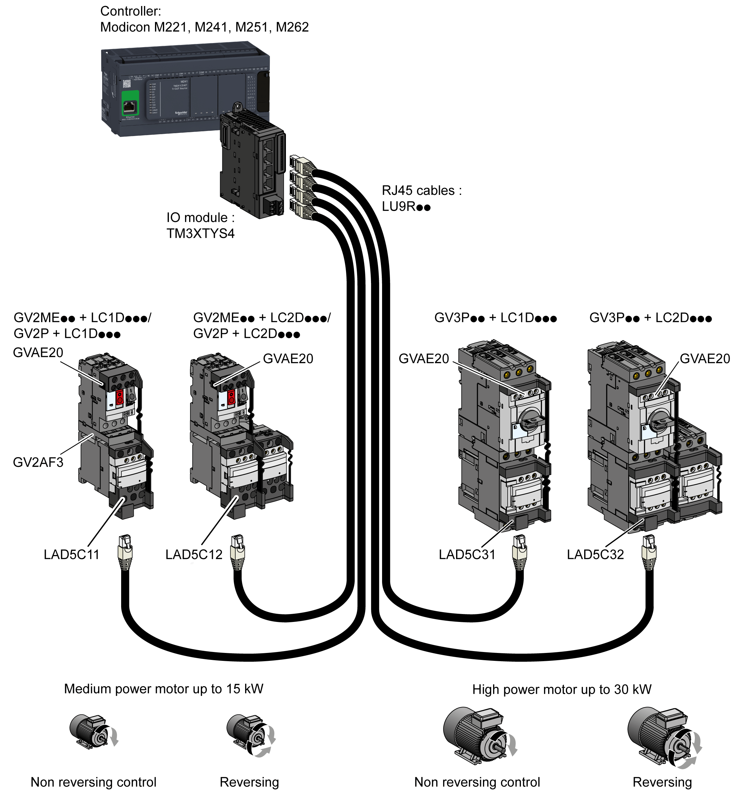
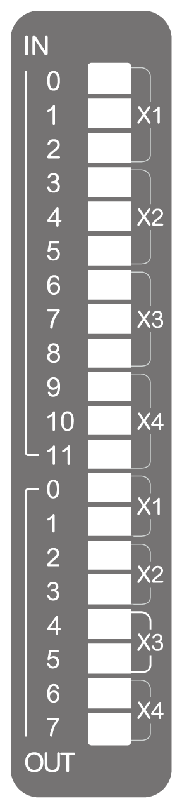

# TM3XTYS4 Presentation

## Overview

TM3XTYS4 TeSys module:

* 4 channels, each with

  + 3 sink inputs
  + 2 source transistor outputs
* Removable 24 Vdc power supply terminal block

## Main Characteristics

| Characteristics | | Value |
| --- | --- | --- |
| **Input** | | Input 1: Ready  Input 2: Run  Input 3: Trip |
| Input type | | 24 Vdc Type 1 (IEC/EN 61131-2) |
| Logic type | | Sink |
| **Output** | | Output 1: Direction 1 control  Output 2: Direction 2 control |
| Output type | | 24 Vdc / 0.3 A |
| Logic type | | Source |
| **Cable types and weight** | | |
| Cable type and length | Type | Ethernet CAT 5E |
| Length | Maximum 5 m (16.4 ft) |
| Weight | | 115 g (4 oz) |

## TM3XTYS4 System Architecture

The TM3XTYS4 module connects the controller to the parallel wiring system of TeSys U and/or TeSys D. This parallel wiring module provides the status and command information for each starter. One TM3XTYS4 module can manage up to 4 starters, reverse or forward, whatever they are TeSys D or TeSys U.

TM3XTYS4 module is compatible with:

* TeSys U system
* TeSys D system

## TeSys U System Architecture Example

TeSys model U is an integrated modular power management system for motor starters. The system provides motor starter overload protection and control functions.

The complete TeSys model U parallel wiring system consists in:

* a power base
* a contactor
* a thermal overload protection device
* a control unit for controller-starters

## TeSys D System Architecture Example

TeSys model D is a motor control interface system for motor starters. The system provides motor starter overload protection and control functions.

The complete TeSys model D parallel wiring system consists in:

* a power base
* a contactor
* a thermal overload protection device
* a control unit for controller-starters

## Status LEDs

The following figure shows the status LEDs:

The following table describes the status LEDs:

| LED | Color | Status | Type | Description |
| --- | --- | --- | --- | --- |
| X1 (0...2) | Green | On | Input | The input channel is activated |
| Off | The input channel is deactivated |
| X2 (3...5) | On | The input channel is activated |
| Off | The input channel is deactivated |
| X3 (6...8) | On | The input channel is activated |
| Off | The input channel is deactivated |
| X4 (9...11) | On | The input channel is activated |
| Off | The input channel is deactivated |
| X1 (0, 1) | On | Output | The output channel is activated |
| Off | The output channel is deactivated |
| X2 (2, 3) | On | The output channel is activated |
| Off | The output channel is deactivated |
| X3 (4, 5) | On | The output channel is activated |
| Off | The output channel is deactivated |
| X4 (6, 7) | On | The output channel is activated |
| Off | The output channel is deactivated |

EIO0000003137.04