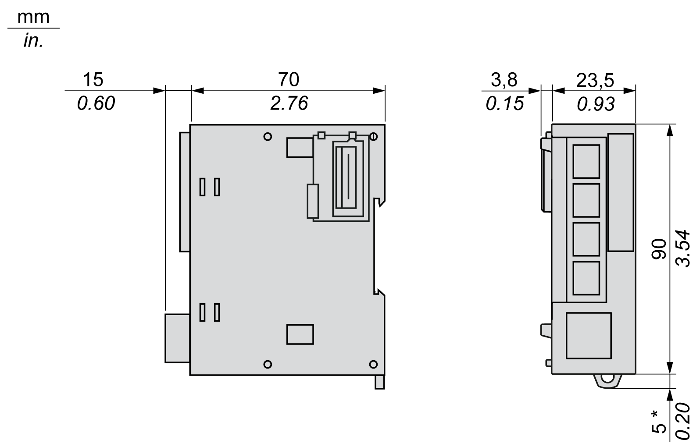

# TM3XTYS4 Characteristics

## Introduction

This section provides a description of the electrical of the TM3XTYS4 module.

See also [Environmental Characteristics](EnvironmentalCharacteristics-9B393E40.html).

| WARNING | |
| --- | --- |
|  | UNINTENDED EQUIPMENT OPERATION  Do not exceed any of the rated values specified in the environmental and electrical characteristics tables.  Failure to follow these instructions can result in death, serious injury, or equipment damage. |

## Dimensions

The following diagrams show the dimensions for the TM3XTYS4 module:

**\*** 8.5 mm (0.33 in) when the clamp is pulled out.

## Input/Output Characteristics

The following table describes the characteristics of one channel RJ45 connector:

| Characteristic | | Value |
| --- | --- | --- |
| **Inputs** | | 3 inputs   * Input 1: Ready * Input 2: Run * Input 3: Trip |
| Number of channels groups | | 1 common line for 3 inputs(1) |
| Input type | | Type 1 (IEC/EN 61131-2) |
| Logic type | | Sink |
| Rated input voltage | | 24 Vdc |
| Input voltage range | | 19.2...28.8 Vdc |
| Rated input current | | 5 mA |
| Turn on time | | Typically 5 ms |
| Turn off time | | Typically 5 ms |
| **Outputs** | | 2 outputs   * Output 1: Direction 1 control * Output 2: Direction 2 control |
| Output type | | Transistor |
| Logic type | | Source |
| Rated input voltage | | 24 Vdc |
| Output voltage range | | 19.2...28.8 Vdc |
| Rated output current | | 300 mA per channel |
| Voltage drop | | Typically 0.15 Vdc (0.4 Vdc maximum) |
| Leakage current when switched off | | 0.1 mA maximum |
| Inductive load | | L/R = 10 ms |
| Turn on time | | Typically 400 µs (450 µs maximum) |
| Turn off time | | Typically 400 µs (450 µs maximum) |
| Protection against short circuit | | Yes |
| Clamping voltage | | Typically 40 Vdc |
| **Module** | | |
| Isolation | Between input and internal logic | 500 Vac |
| Between output and internal logic | 500 Vac |
| Connection type | | RJ45 connector |
| Connector insertion/removal durability | | Over 100 times |
| Current draw on 5 Vdc internal bus | | 37 mA (all inputs and outputs on) |
| 17 mA (all inputs and outputs off) |
| Current draw on 24 Vdc internal bus | | 17 mA (all inputs and outputs on) |
| 0 mA (all inputs and outputs off) |
| **(1)** The common line (pins 3) of the 4 RJ45 connectors are internally connected together. The 12 inputs of the module share the same common. | | |

EIO0000003137.04