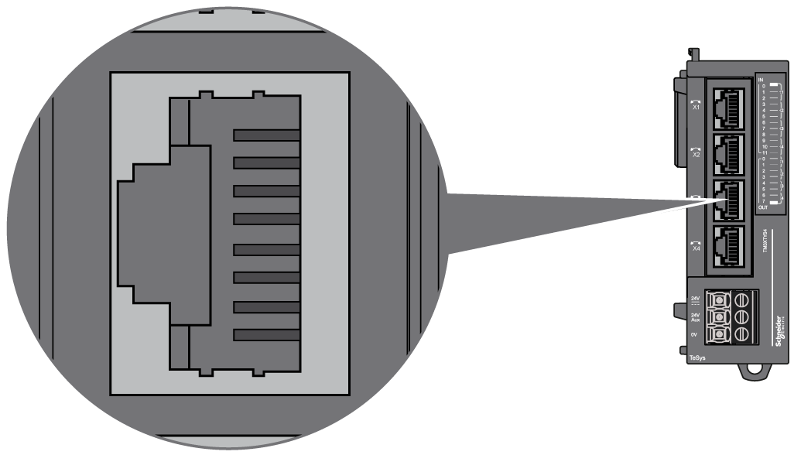

# TM3XTYS4 Wiring Diagram

## Wiring Rules

See [Wiring Best Practices](D-SE-0026685.html#D-SE-0026685).

## I/O Channel RJ45 Connector

The TM3XTYS4 module is equipped with 4 channels RJ45 connector:

## Pin Assignment

The following graphic and table show the channel RJ45 connector pin assignment:

| Pin N° | Designation | Signal | Description |
| --- | --- | --- | --- |
| 1 | Output 1 | Direction 1 control | Drives the direct (forward) command of the motor. |
| 2 | Output 2 | Direction 2 control | Drives the reverse (backward) command of the motor. |
| 3 | 0 V | – | – |
| 4 | Input 1 | Ready | Active if the selector of TeSys is in the ON position. |
| 5 | Input 2 | Run | Input active if the power contacts of TeSys are closed. |
| 6 | N.C. | – | Reserved. Do not connect. |
| 7 | Input 3 | Trip | Input active if the selector of TeSys is in the TRIP position (only for TeSys U). |
| 8 | 24 Vdc input common | Common for sensors | Power supply for inputs 1, 2 and 3 (pins 4, 5 and 7). |

| WARNING | |
| --- | --- |
|  | UNINTENDED EQUIPMENT OPERATION  Do not connect wires to unused terminals and/or terminals indicated as “No Connection (N.C.)”.  Failure to follow these instructions can result in death, serious injury, or equipment damage. |

| CAUTION | |
| --- | --- |
|  | INCOMPATIBLE EQUIPMENT  Use the RJ45 connector only for the link with devices which are compatible with the TeSys RJ45 connection system.  Failure to follow these instructions can result in injury or equipment damage. |

## DC Power Supply Wiring Diagram

See [DC Power Supply Characteristics](DCPowerSupplyRequirements-63100C1F.html).

EIO0000003137.04