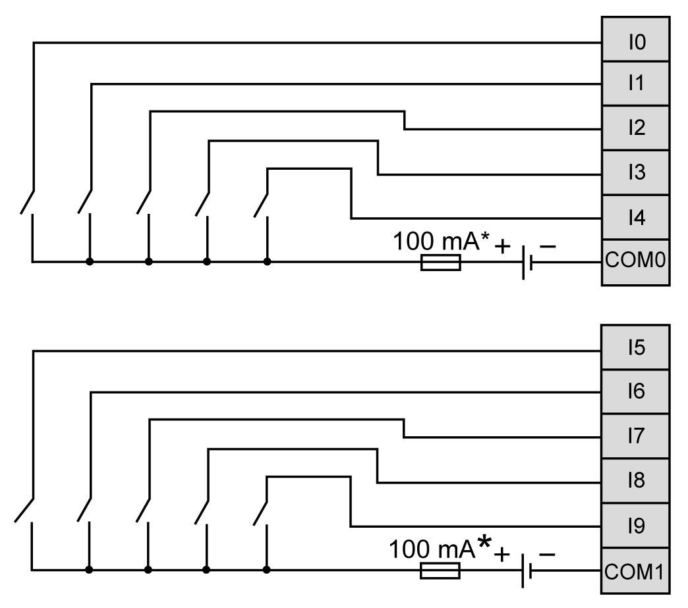
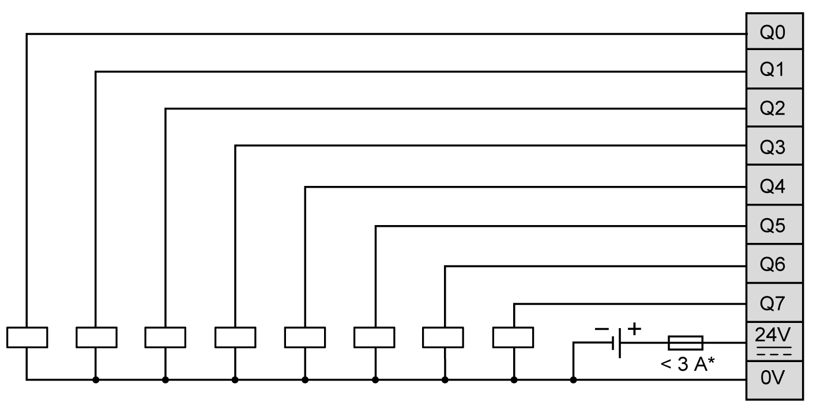
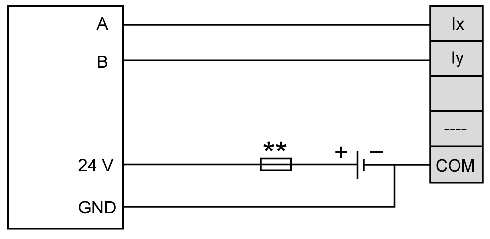

# TM3XFHSC202 / TM3XFHSC202G Wiring Diagram

## Introduction

The TM3XFHSC202 / TM3XFHSC202G are equipped with two removable screw or spring terminal blocks for the connection of inputs, outputs and 24 V power supply.

## Wiring Rules

See [Wiring Best Practices](D-SE-0026685.html#D-SE-0026685).

## Wiring Diagram

The following diagram shows the wiring of the inputs:

**\*** Type T fuse

The following diagram shows the wiring outputs:

**\*** Connect an appropriate type T fuse for the load, not to exceed 3 A.

## Encoder Wiring

The following diagram shows the encoder wiring:

**\*\*** Refer to the encoder documentation for fuse sizing.

NOTE: You must connect the output GND of the encoder to the COM terminal corresponding to the group of inputs which A and B are connected to:

* `I0...I4`: COM0
* `I5...I9`: COM1

EIO0000003137.04