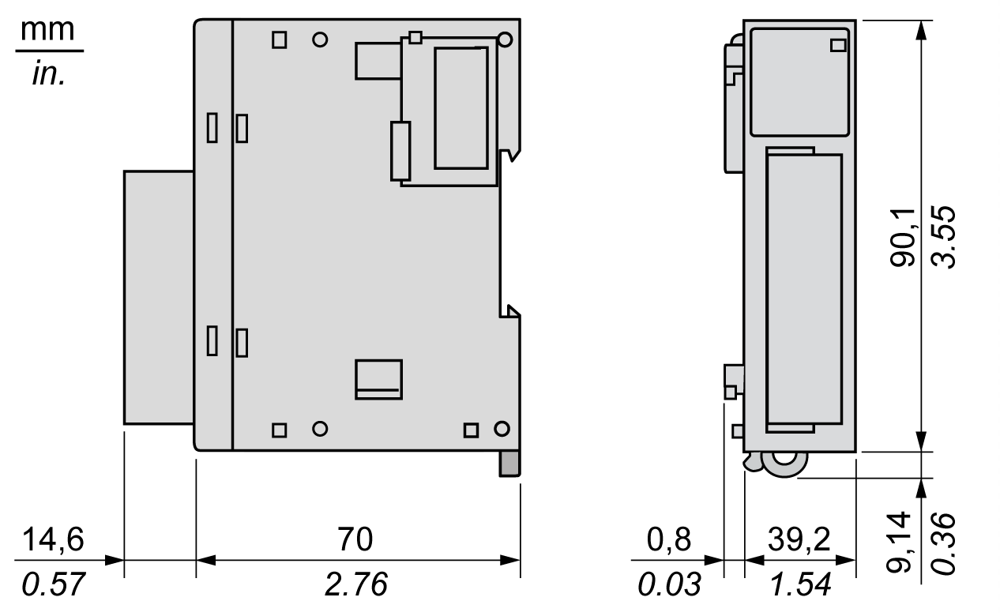

# TM3XHSC202 / TM3XHSC202G Characteristics

## Introduction

This section provides a description of the characteristics of the TM3XHSC202 / TM3XHSC202G modules. See also [Environmental Characteristics](EnvironmentalCharacteristics-9B393E40.html).

| WARNING | |
| --- | --- |
|  | UNINTENDED EQUIPMENT OPERATION  Do not exceed any of the rated values specified in the environmental and electrical characteristics tables.  Failure to follow these instructions can result in death, serious injury, or equipment damage. |

## Dimensions

The following diagram shows the dimensions of the TM3XHSC202 / TM3XHSC202G modules:

## Input Characteristics

| Characteristics | | Value |
| --- | --- | --- |
| Number | | 10 |
| Number of channel groups | | 2 channel groups:  1 common line for I0 ...I4  1 common line for I5 ...I9 |
| Input type | | Type 1 (IEC 61131-2) |
| Logic type | | Sink |
| Rated input voltage | | 24 Vdc |
| Input voltage limit | | Maximum 30 Vdc |
| Rated input current | | 7.5 mA |
| Input impedance | | 2.81 kΩ |
| Input limit values | Voltage at state 1 | > 15 Vdc (15...28.8 Vdc) |
| Voltage at state 0 | < 5 Vdc (0...5 Vdc) |
| Current at state 1 | > 3 mA |
| Current at state 0 | < 1.5 mA |
| Turn on time | | < 1 µs + filter delay |
| Turn off time | | < 1 µs + filter delay |
| Maximum input frequency | | 200 kHz |
| Isolation | Between input and internal logic | 550 Vac for 1 minute |
| Between input groups | None |
| Between input channels | None |
| Between inputs and outputs | 550 Vac for 1 minute |
| Cable type | | Shielded cable, including the COM signal  Length: Maximum 10 m |

## Output Characteristics

| Characteristics | Value |
| --- | --- |
| Number | 8 |
| Number of channel groups | 2 channel groups:  Q0...Q3  Q4...Q7 |
| Output type | Transistor |
| Logic type | Source (push-pull) |
| Rated output voltage | 24 Vdc |
| Rated output current | 300 mA |
| Total rated output current per group | Maximum 1.2 A |
| Maximum power of filament lamp | Maximum 0.9 W |
| Leakage current | ≤ 0.15 mA |
| Turn on time | Maximum 1 µs |
| Turn off time | Maximum 1 µs |
| Protection against short circuit or overload | Yes, typically 1 A per output  Error managed by group:   * Q0...Q3 * Q4...Q7 |
| Automatic rearming after short circuit or overload | Yes, 10 s  Enabled/Disabled by EcoStruxure Machine Expert |
| Clamping voltage | Typically 45 Vdc |
| Isolation | Between outputs and internal logic: 550 Vac for 1 minute |
| Between output groups: none |
| Between output channels: none |
| Between outputs and inputs: 550 Vac for 1 minute |
| Cable length | < 30 m |

## Power Characteristics

| Characteristics | Value |
| --- | --- |
| Type | PELV |
| Voltage nominal | 24 Vdc |
| Voltage limits | 20.4...28.8 Vdc with a maximum ripple of 10% of nominal voltage |
| Input current | Maximum 2.5 A |
| Inrush current | Not limited (except by overload peak current) |
| Voltage drop immunity | No |
| Reverse polarity protection | Yes |
| Overvoltage protection | No (external fuse required) |
| Power presence detection | Yes, threshold 15 V |
| Isolation | 550 Vac for 1 minute with internal logic |
| Cable length | < 3 m |

EIO0000003137.04