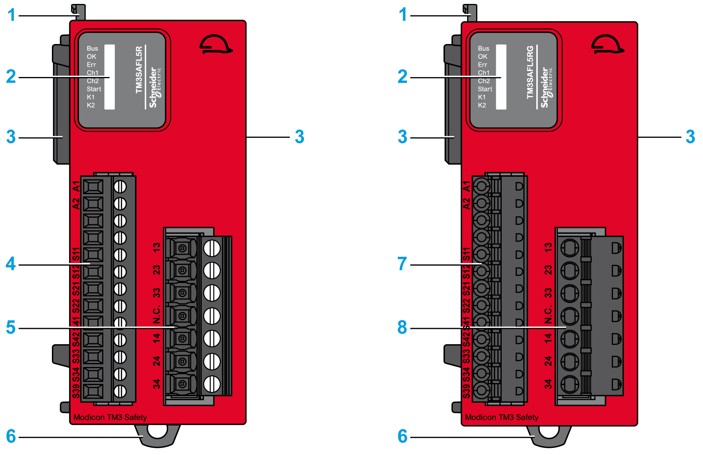

# TM3 Safety Module with Removable Screw or Spring Terminal Block

TM3 Safety Module with Removable Screw or Spring Terminal Block

This figure illustrates the main elements of a TM3 safety module with removable screw or spring terminal blocks:

This table describes the main elements of the TM3 safety modules:

| Label | Elements | |
| --- | --- | --- |
| 1 | Locking device for attachment to the previous module. | |
| 2 | Status LED indicators | |
| 3 | [Expansion connector](../glossary/glossary.htm#XREF_D_SE_0024697_696) for TM3 Bus (one on each side). | |
| 4 | Power supply and input removable screw terminal block with a 3.81 mm (0.15 in) pitch. | [Rules for removable screw terminal block](../TM3_Installation/TM3_Installation-13.htm#XREF_D_SE_0037074_10) |
| 5 | Relay output removable screw terminal block with a 5.08 mm (0.20 in) pitch. |
| 6 | Clip-on lock for 35 mm (1.38 in.) DIN-rail. | [Top hat section rail (DIN rail)](../TM3_Installation/TM3_Installation-8.htm#XREF_D_SE_0009395_1) |
| 7 | Power supply and input removable spring terminal block with a 3.81 mm (0.15 in) pitch. | [Rules for removable spring terminal block](../TM3_Installation/TM3_Installation-13.htm#XREF_D_SE_0037074_11) |
| 8 | Relay output removable spring terminal block with a 5.08 mm (0.20 in) pitch. |

This table presents the symbols printed on the product:

| Symbol | Reference | Title |
| --- | --- | --- |
| SG_0061_10pt.gif | IEC 60417-5032 | Alternating current (ac) |
| SG_0063_10pt.gif | IEC 60417-5031 | Direct current (dc) |
| G-SE-0026483.1.gif-high.gif | ISO 7000-0434A | Caution |