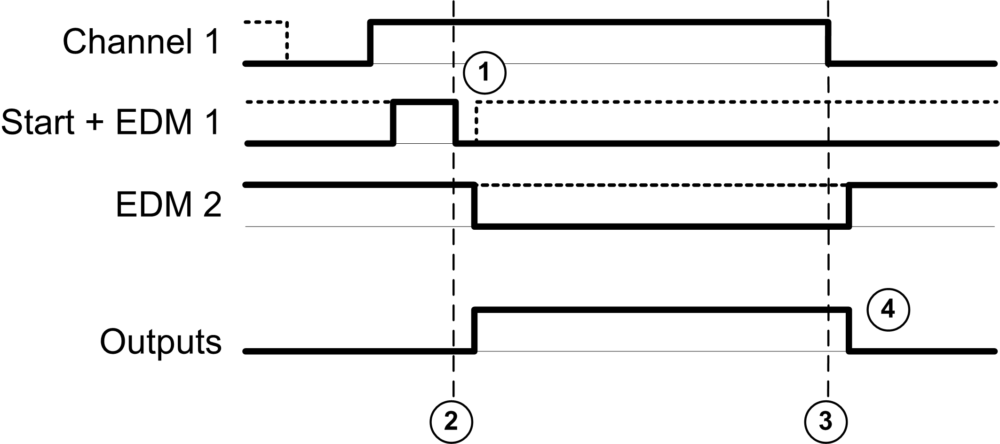

# Monitored Start

Monitored Start

This table presents the module type available in a 1 channel application with a monitored start:

| Reference | Channel 1 | Start + EDM 1 | EDM 2 | Outputs |
| --- | --- | --- | --- | --- |
| TM3SAK6R | S11-S12 | S33-S34 | S41-S42 | 13-14  23-24  33-34 |

This figure represents the output activation management in a 1 channel application with a monitored start:

Events description:

1.Monitored start condition is triggered by a falling edge on the start input.

2.Safety inputs + start conditions are valid

3.Safety inputs condition invalid

4.The outputs react to the safety input and start conditions with a delay given by system constraints.