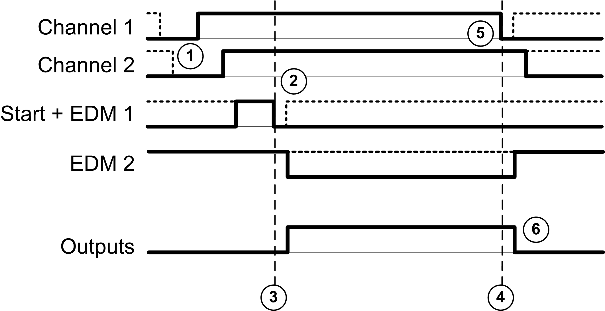

# Monitored Start

Monitored Start

This table presents the module types available in a 2 channel application with a monitored start:

| Reference | Channel 1 | Channel 2 | Start + EDM 1 | EDM 2 | Outputs |
| --- | --- | --- | --- | --- | --- |
| TM3SAF5R | S11-S12 | S21-S22 | S33-S34 | S41-S42 | 13-14  23-24  33-34 |
| TM3SAFL5R |
| TM3SAK6R | S21-S22 | S31-S32 |

This figure represents the output activation management in a 2 channel application with a monitored start:

Events description:

1.Both S2 and S3 inputs must be set to off before the outputs can be activated. This condition is called interlock. For more information, refer to the TM3 Expansion Modules Programming Guide for your software platform.

2.Monitored start condition is triggered by a falling edge on the start input.

3.Safety inputs + start conditions are valid

4.Safety inputs condition invalid

5.At least 1 input is off

6.The outputs react to the safety inputs and start conditions with a delay given by system constraints.