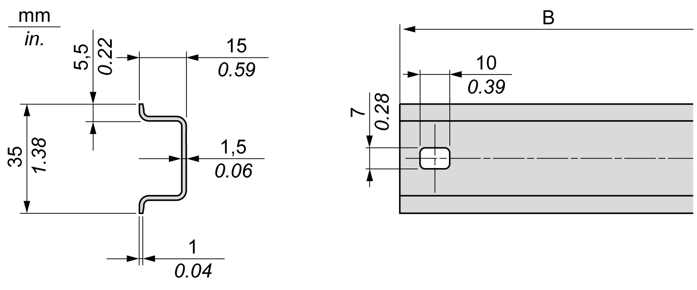
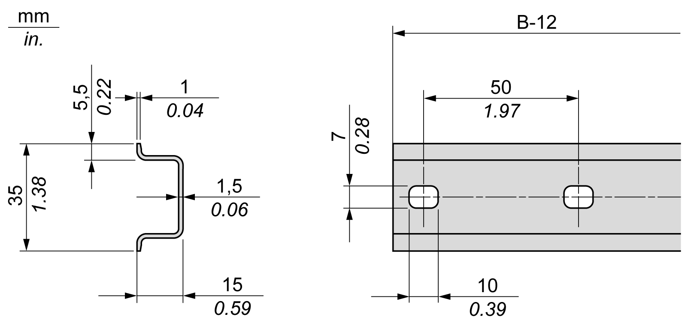
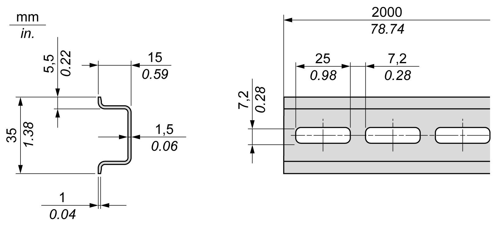

# Symmetric Top Hat Section Rails (DIN Rail)

Symmetric Top Hat Section Rails (DIN Rail)

The following illustration and table show the references of the top hat section rails (DIN rail) for the wall-mounting range:

| Reference | Type | Rail Length (B) |
| --- | --- | --- |
| NSYSDR50A | A | 450 mm (17.71 in.) |
| NSYSDR60A | A | 550 mm (21.65 in.) |
| NSYSDR80A | A | 750 mm (29.52 in.) |
| NSYSDR100A | A | 950 mm (37.40 in.) |

The following illustration and table show the references of the symmetric top hat section rails (DIN rail) for the metal enclosure range:

| Reference | Type | Rail Length (B-12 mm) |
| --- | --- | --- |
| NSYSDR60 | A | 588 mm (23.15 in.) |
| NSYSDR80 | A | 788 mm (31.02 in.) |
| NSYSDR100 | A | 988 mm (38.89 in.) |
| NSYSDR120 | A | 1188 mm (46.77 in.) |

The following illustration and table shows the references of the symmetric top hat section rails (DIN rail) of 2000 mm (78.74 in.):

| Reference | Type | Rail Length |
| --- | --- | --- |
| NSYSDR2001 | A | 2000 mm (78.74 in.) |
| NSYSDR200D2 | A |
| 1   Unperforated galvanized steel  2   Perforated galvanized steel | | |