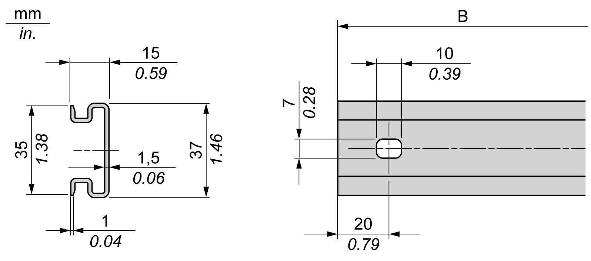
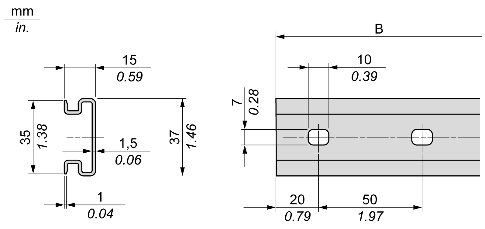

# Double-Profile Top Hat Section Rails (DIN rail)

Double-Profile Top Hat Section Rails (DIN rail)

The following illustration and table show the references of the double-profile top hat section rails (DIN rails) for the wall-mounting range:

| Reference | Type | Rail Length (B) |
| --- | --- | --- |
| NSYDPR25 | W | 250 mm (9.84 in.) |
| NSYDPR35 | W | 350 mm (13.77 in.) |
| NSYDPR45 | W | 450 mm (17.71 in.) |
| NSYDPR55 | W | 550 mm (21.65 in.) |
| NSYDPR65 | W | 650 mm (25.60 in.) |
| NSYDPR75 | W | 750 mm (29.52 in.) |

The following illustration and table show the references of the double-profile top hat section rails (DIN rail) for the floor-standing range:

| Reference | Type | Rail Length (B) |
| --- | --- | --- |
| NSYDPR60 | F | 588 mm (23.15 in.) |
| NSYDPR80 | F | 788 mm (31.02 in.) |
| NSYDPR100 | F | 988 mm (38.89 in.) |
| NSYDPR120 | F | 1188 mm (46.77 in.) |