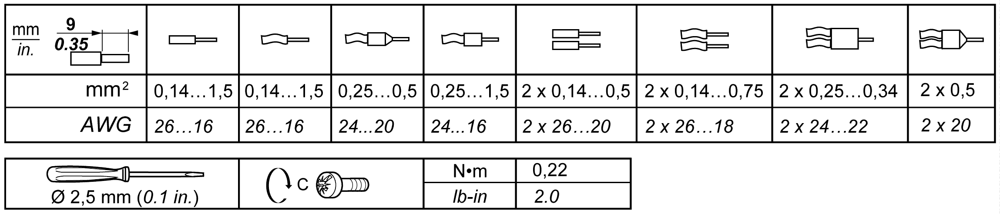
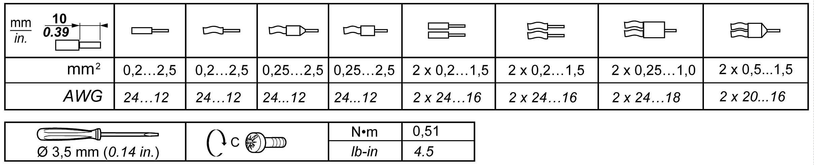

# Rules for Removable Screw Terminal Block

Rules for Removable Screw Terminal Block

The following tables show the cable types and wire sizes for a 3.81 mm (0.15 in.) pitch removable screw terminal block (I/Os and power supply):

The following tables show the cable types and wire sizes for a 5.08 mm (0.20 in.) pitch removable screw terminal block (outputs):

The use of copper conductors is required.

|  |
| --- |
| Danger_Color.gifDANGER |
| FIRE HAZARD |
| oUse only the correct wire sizes for the current capacity of the I/O channels and power supplies.  oFor relay output (2 A) wiring, use conductors of at least 0.5 mm2 (AWG 20) with a temperature rating of at least 90 °C (194 °F).  oFor common conductors of relay output wiring (7 A), or relay output wiring greater than 2 A, use conductors of at least 1.0 mm2 (AWG 16) with a temperature rating of at least 90 °C (194 °F). |
| Failure to follow these instructions will result in death or serious injury. |

Applying torque above the limit may damage the terminal screw or threads.

|  |
| --- |
| NOTICE |
| INOPERABLE EQUIPMENT |
| Do not tighten screw terminals beyond the specified maximum torque (Nm / lb-in.). |
| Failure to follow these instructions can result in equipment damage. |