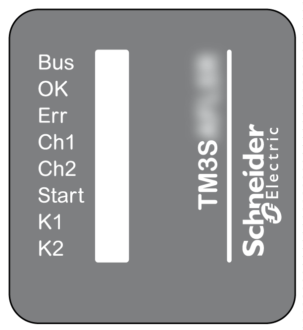

# Status LED

Status LED

This figure shows the status LEDs:

This table provides the TM3SAK6R• module status LED indicators description:

| LED | Color | Status | Description |
| --- | --- | --- | --- |
| Bus | Green | Flashing | The module is receiving the 5 Vdc power supply from the TM3 Bus and the TM3 Bus is functioning. |
| OK | Green | On | +24 Vdc power supply provided to the module is in the voltage tolerance. |
| Flashing | TM3 Bus time-out: the functional safety operation is maintained. |
| Err | Red | On | +24 Vdc power supply provided to the module is out of the voltage tolerance. |
| Flashing | TM3 Bus time-out: the safety output is deactivated (off). |
| Ch1 | Green | On | Depending on the application. See next table. |
| Flashing | Synchronization time monitoring detected an error: input S21-S22 closed too late after input S31-S32. |
| Ch2 | Green | On | Depending on the application. See next table. |
| Flashing | Synchronization time monitoring detected an error: input S31-S32 closed too late after input S21-S22. See note below. |
| Start | Green | On | Start condition valid: inputs S11-S12, S21-S22, S31-S32, and S41-S42 (EDM 2) closed/supplied, and S34 or S39 connected to S33. See note below. |
| K1 | Green | On | K1 relay energized (closed) |
| Flashing | Waiting for start condition |
| K2 | Green | On | K2 relay energized (closed) |
| Flashing | Waiting for start condition |

This table gives information on Ch1 and Ch2 status:

| Use case | Channel | Condition |
| --- | --- | --- |
| 1-channel application (cat. 1) | Ch1 | Input S11-S12 closed and input S31-S32 closed with a jumper. |
| Ch2 | Input S21-S22 closed with a jumper. |
| 2-channel application (cat. 3 - w/o short-circuit monitoring) | Ch1 | Input S11-S12 and input S31-S32 closed. |
| Ch2 | Input S21-S22 closed with a jumper. |
| 2-channel application (cat. 4) | Ch1 | Input S11-S12 closed and input S31-S32 closed with a jumper. |
| Ch2 | Input S21-S22 closed. |
| 2-channel application (cat. 3 - if the sensor device can detect short-circuit, then cat. 4)  Solid state: PNP + PNP | Ch1 | Input S12 and input S32 supplied with PNP 24 V connection. |
| Ch2 | Input S21-S22 closed with a jumper. |
| 2-channel application (cat. 4)  Solid state: PNP + NPN | Ch1 | Input S11-S12 closed with a jumper and input S32 supplied with PNP 24 V connection. |
| Ch2 | Input S22 connected to external NPN 0 V. |
| Safety mat application | Ch1 | Input S11-S12 closed by jumper, with safety mat connected to input S31-S32. |
| Ch2 | Safety mat connected to input S21-S22. |

NOTE: While waiting for Start there is no indication of Ch2 if S41-S42 (EDM 2) is open (by feedback of external device (NC contact)).