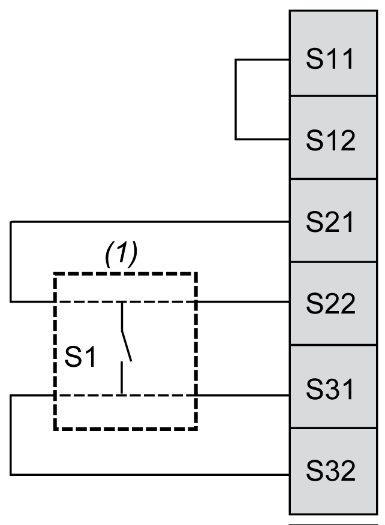

# Safety-Mat Wiring

Safety-Mat Wiring

This figure shows an example of safety-mat (pressure sensitive, short circuit generating) wiring to the safety module inputs:

(1):   Safety-mat

NOTE: Normally, most safety-mats are maladapted for use in combination with the automatic start mode. In addition, if you use the safety-mat in your application which includes the automatic start mode, you should consider this in your risk analysis.

|  |
| --- |
| Warning_Color.gifWARNING |
| UNINTENDED EQUIPMENT OPERATION |
| Only use short-circuit generating pressure sensitive devices according to ISO/EN 13856-1:2013 for the safety-mat function. |
| Failure to follow these instructions can result in death, serious injury, or equipment damage. |