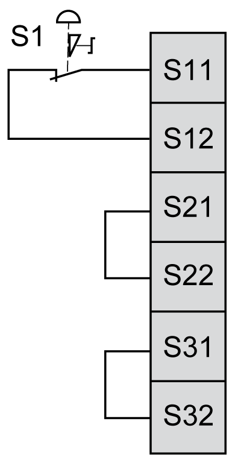

# One Channel Emergency Stop Wiring

One Channel Emergency Stop Wiring

This figure illustrates an example of 1 channel emergency stop wiring to the safety module inputs:

S1:   Emergency stop switch