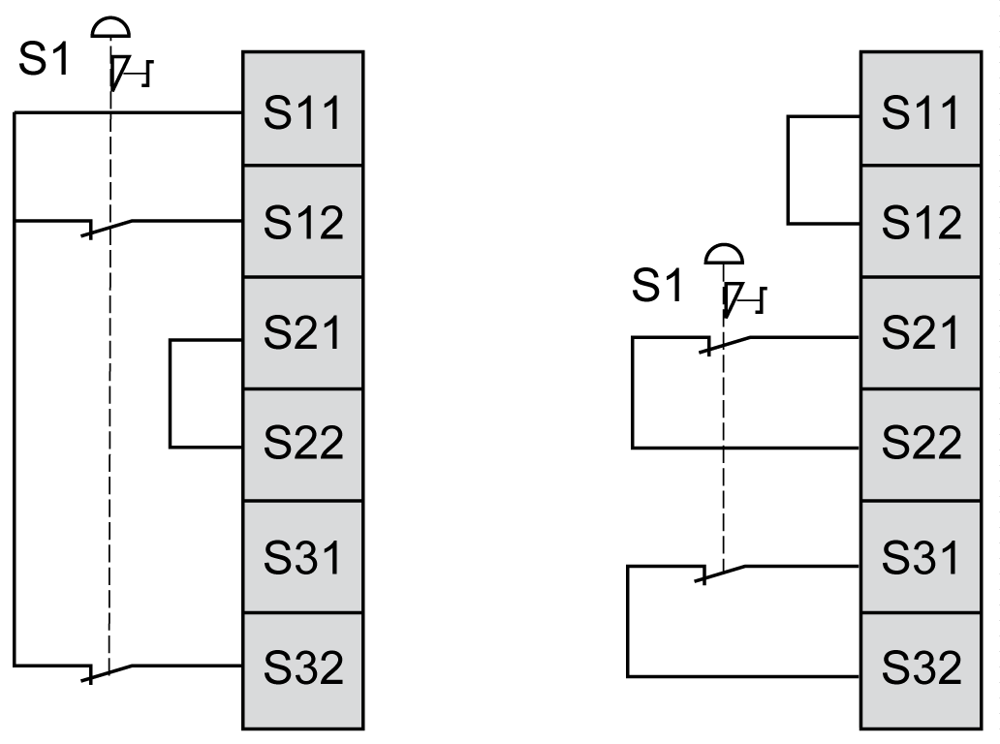

# Two Channel Emergency Stop Wiring

Two Channel Emergency Stop Wiring

This figure illustrates two examples of 2 channel emergency stop wiring to the safety module inputs:

S1:   Emergency stop switch

NOTE: Inputs S11 and S12 are not intended for the monitoring of short-circuits in external wiring.

|  |
| --- |
| Warning_Color.gifWARNING |
| UNINTENDED EQUIPMENT OPERATION |
| Do not use the S11 and S12 inputs to build SIL 3 applications unless you exclude the possibility of short-circuits by external measures. |
| Failure to follow these instructions can result in death, serious injury, or equipment damage. |