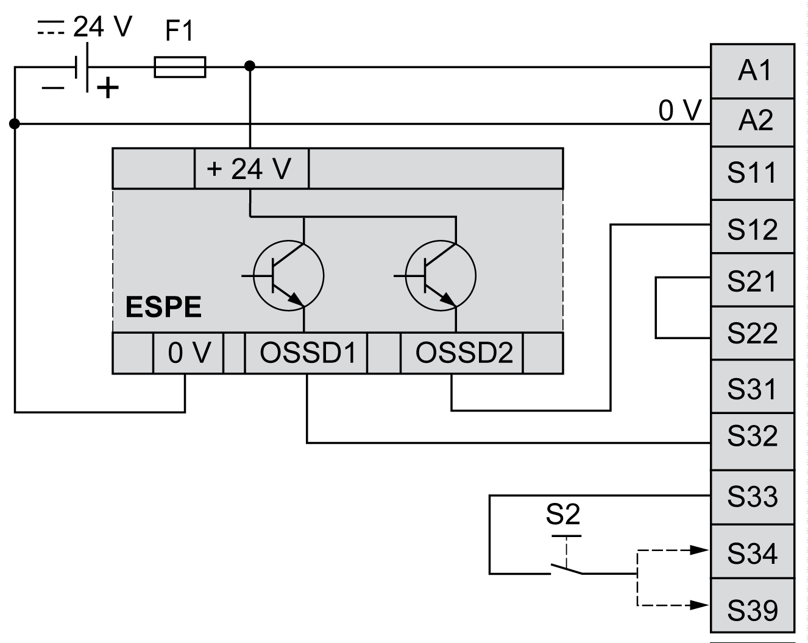

# Electro-Sensitive Protective Equipment (ESPE) Wiring

Electro-Sensitive Protective Equipment (ESPE) Wiring

This figure shows an example of ESPE (type 4 outputs, IEC/EN 61496-1) wiring to the safety module inputs:

S2:   Start switch

NOTE: The ESPE must be supplied by the same PELV/SELV power supply as the safety module.

NOTE:

The outputs (OSSD) of ESPE may generate test pulses. Depending on duration and frequency of the pulses, the following behaviors may happen:

oElectromagnetic interference from the module relays.

oThe K1 and K2 relay diagnostics in the controller detects these pulses. To avoid this, a filter with a delay time of at least the pulse length can be defined in the controller.

oPulses longer than 1ms can cause the module outputs to turn off.

NOTE: The OSSD of ESPE typically generate test pulses with various duration and frequency.

oThis can cause the relays inside the module to make some noise.

oThe pulses might be visible in the K1/K2 diagnostic information in the PLC. To avoid this, a filter with appropriate delay time can be defined in the PLC.

oTest pulses longer than 1 ms can cause the outputs of the module to switch off.