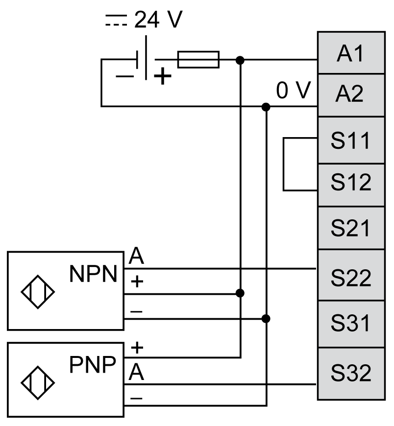

# Proximity Sensors with Short Circuit Detection Wiring

Proximity Sensors with Short Circuit Detection Wiring

This figure shows an example of a 2 channel application (PNP + NPN complementary sensors) wiring to the safety module inputs:

NOTE: The sensors must be supplied by the same PELV/SELV power supply as the safety module.